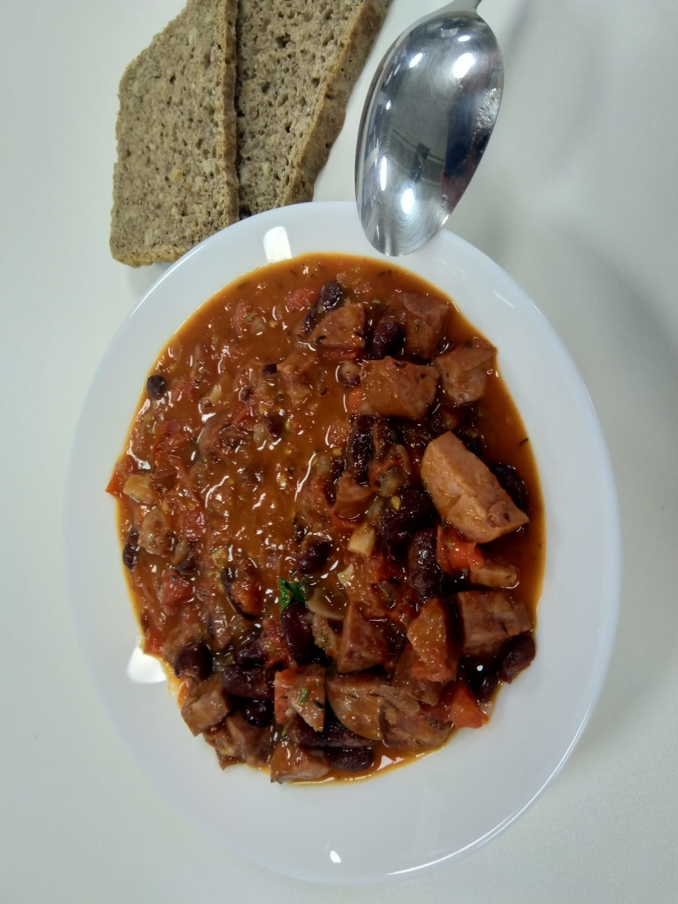
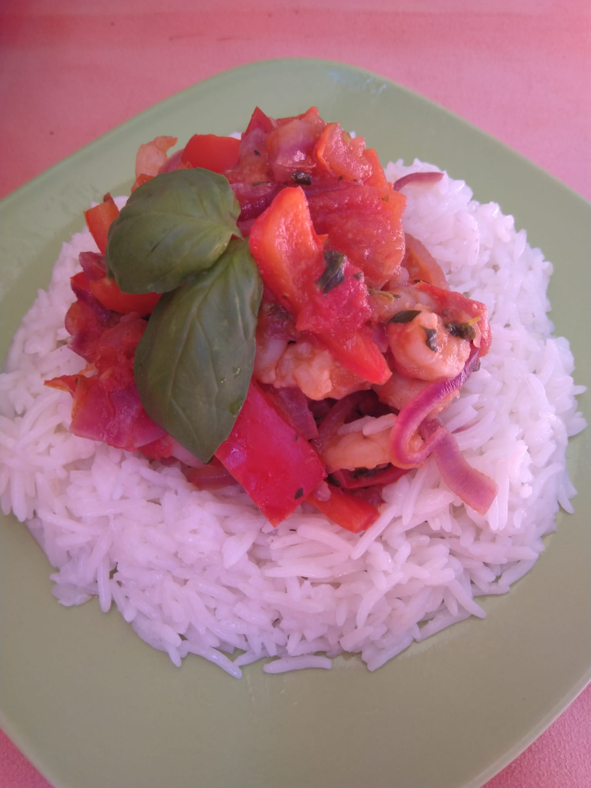
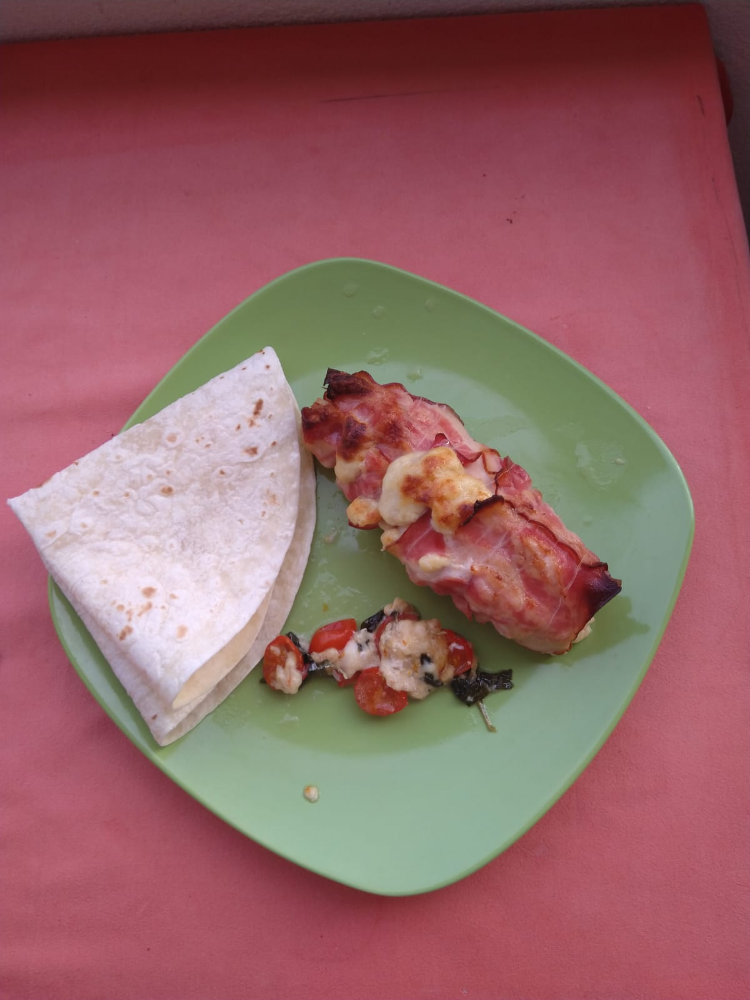
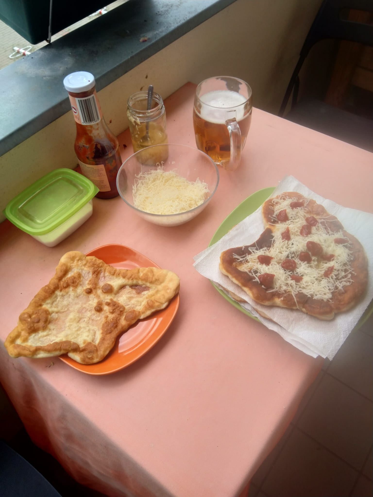
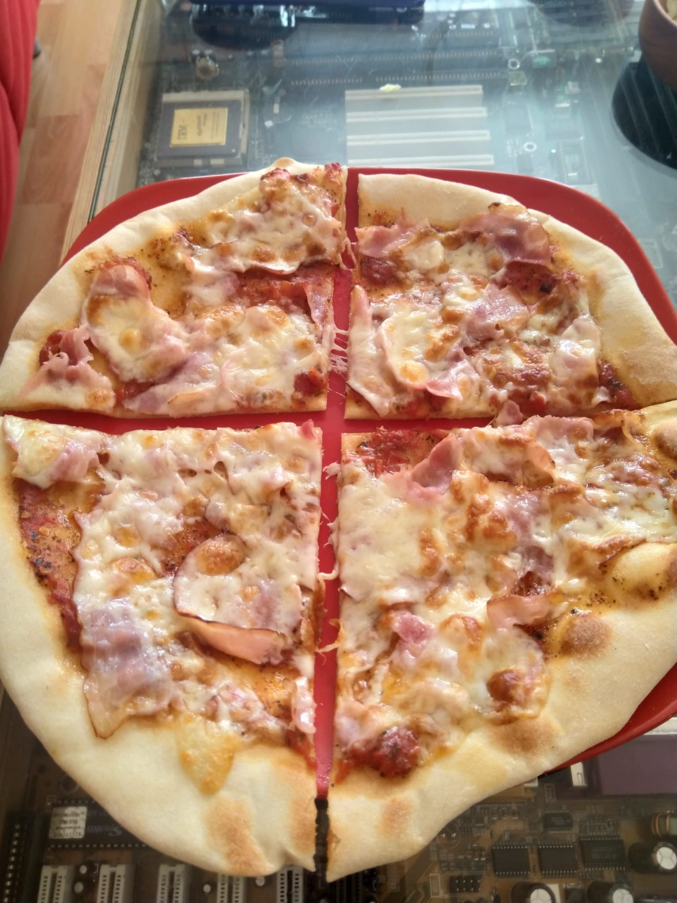
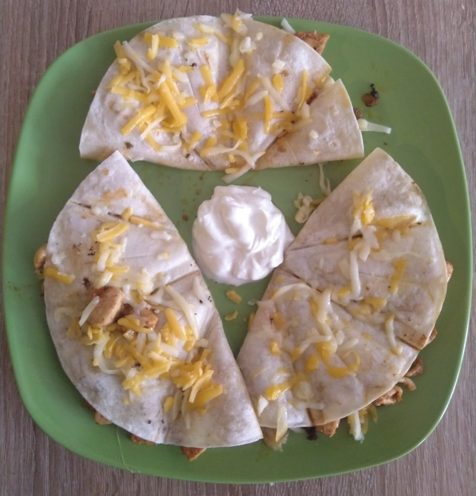
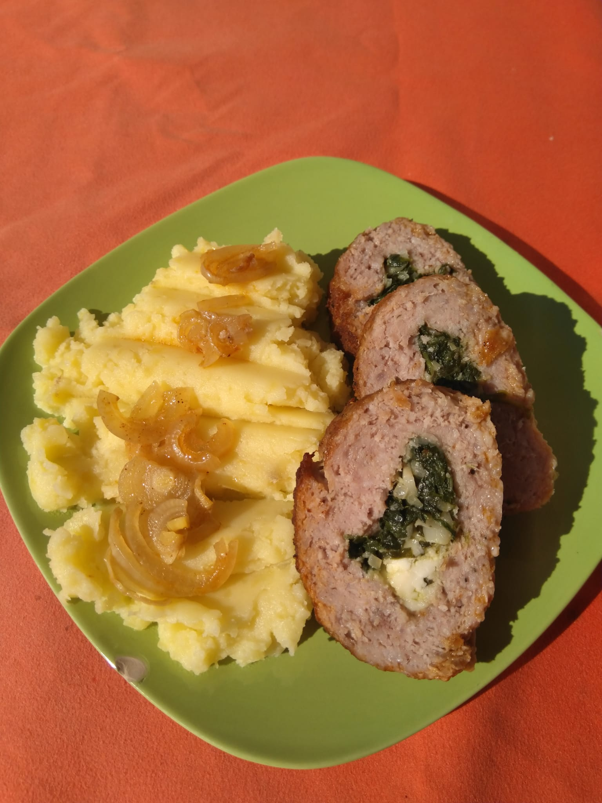
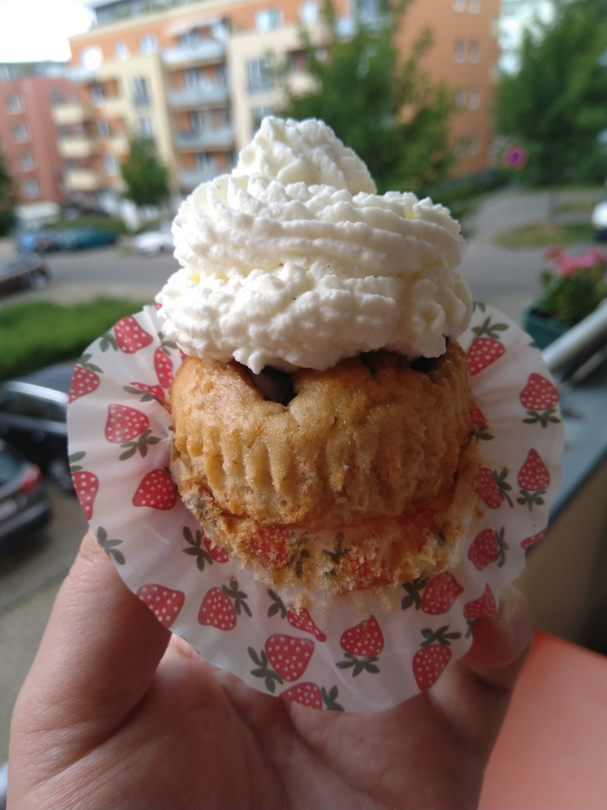
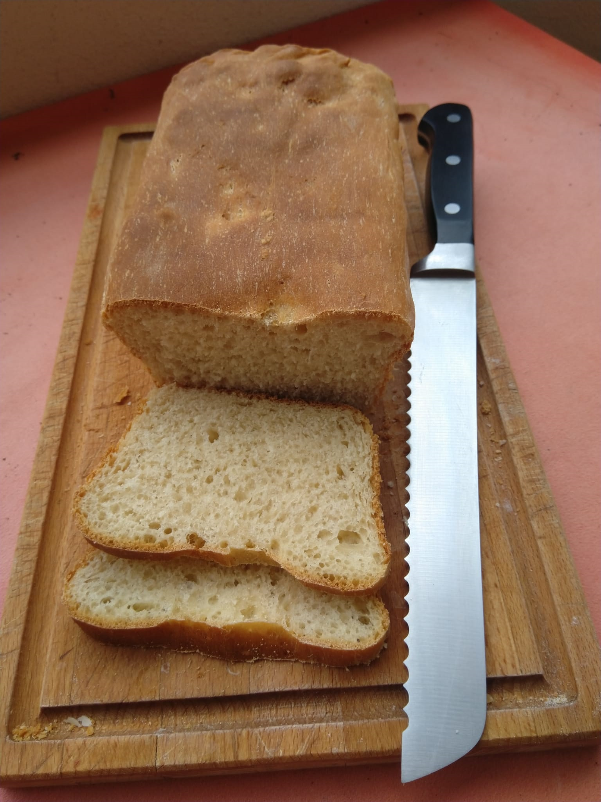
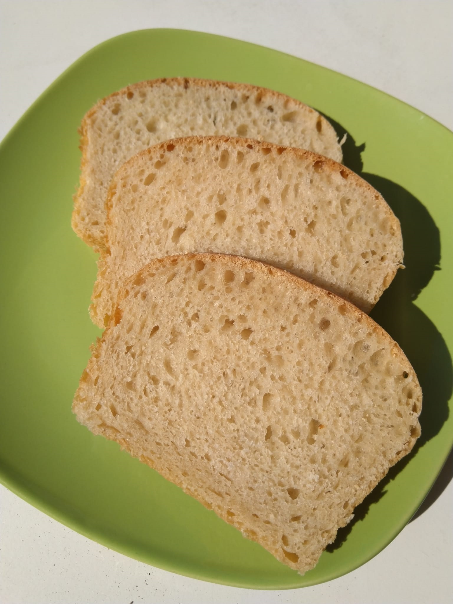

# Kuchařka

* [Saláty](#sekce-salaty)
* [Hlavní jídla](#sekce-jidla)
* [Dipy, pesta, marinády](#sekce-dipy)
* [Dezerty](#sekce-dezerty)
* [Pečivo](#sekce-pecivo)
# Saláty 

## Obsah

* [Krabí salát](#krabi-salat)
* [Těstovinový salát](#testovinovy-salat)

## Krabí salát 

* 4 cherry rajčata
* 1 rajče
* 2 mozzarely
* 100 g eidamu
* 1 balení krabích prstů (cca 12-16 prstů)
* 1 malý kelímek bílého jogurtu (cca 6 lžic)
* 3 lžíce majonézy
* oregano, bazalka, pepř

Eidam nastrouhat, rajčata, mozzarelu a prsty nakrájet na kostičky.

## Těstovinový salát 

* 300g penne těstovin
* 2 rajčata
* 1/4 červené papriky
* 4 ks zavařené papriky
* 10 dkg šunky
* 10 dkg nastrouhaného eidamu
* pár listů salátu
* bílý jogurt
* sůl, pepř, oregano, sezamová semínka, lněná semínka, bazalka
* olivový olej na pokapání

# Hlavní jídla 

## Obsah

* [Balkánská tortilla](#balkan-tortilla)
* [Buřtguláš](#burtgulas)
* [Čínské nudle](#cinske-nudle)
* [Dýňová polévka](#dynova-polevka)
* [Dýňové rizoto](#dynove-rizoto)
* [Fazole s klobásou](#fazole-klobasa)
* [Filé po italsku](#file-po-italsku)
* [Gnocchi se smetanovo-houbovou omáčkou](#gnocchi-houby)
* [Gyros s pitou](#gyros-s-pitou)
* [Hovězí maso na víně s kořenovou zeleninou](#hovezi-na-vine)
* [Cheeseburger](#cheeseburger)
* [Chilli con carne](#chilli-con-carne)
* [Kari rýže](#kari-ryze)
* [Koprovka](#koprovka)
* [Krevetové rizoto](#krevetove-rizoto)
* [Kuře na červeno](#kure-na-cerveno)
* [Kuře na paprice](#kure-na-paprice)
* [Kuřecí prsa plněná mozzarelou](#kure-s-mozzarelou)
* [Kuřecí prsa plněná pestem](#kure-s-pestem)
* [Kuskus s kuřecími nugetky](#kuskus-s-kurecimi-nugetky)
* [Langoše](#langose)
* [Lečo](#leco)
* [Marinované krůtí kousky s pórkem a rýží](#marinovane-kruti-kousky-s-porkem-a-ryzi)
* [Musaka (variace)](#musaka)
* [Nepálivá Garam masala kuře](#nepalive-indicke-kure)
* [Pizza Bianca](#pizza-bianca)
* [Pizza Napoletana](#pizza-napoletana)
* [Quesadilla](#quesadilla)
* [Rajská omáčka s karlovarským knedlíkem](#rajska-omacka-s-karlovarskym-knedlikem)
* [Ruské pelmeně](#ruske-pelmene)
* [Segedín](#segedin)
* [Sekaná s olivami](#sekana-s-olivami)
* [Slaný řecký koláč](#slany-recky-kolac)
* [Slaný závin](#slany-zavin)
* [Smažená rýže s vejcem](#smazena-ryze-s-vejcem)
* [Sýrová omáčka](#syrova-omacka)
* [Špagety Carbonara](#spagety-carbonara)
* [Špenátový krém s noky](#spenatovy-krem-s-noky)
* [Tagliatelle s lososem](#tagliatelle-s-lososem)
* [Utopenci](#utopenci)
* [Vepřová roláda se špenátem](#veprova-rolada-se-spenatem)

## Balkánská tortilla 

1 porce:

* 1 větší tortilla (ideálně stejné velikosti jako dno vaší ploché pánve)
* 150 g nastrouhaného eidamu
* hrst nasekaných bazalkových listů
* 150 g kostiček balkánského sýra
* hrst nasekaných černých oliv
* 8 cherry rajčat nakrájených na kostičky
* 2 rozkvedlaná vejce

Pánev rozehřát na mírném plameni a zlehka potřít olejem. Tortilu namočit na chvíli do vody, a pak položit na pánev. Horní stranu potřít polovinou vajec a posypat sto gramy eidamu. Nechat tortillu smažit na slabém dokud vejce nepřestane být tekuté.

Potom celou tortillu otočit. Horní stranu potřít zbytkem vejce a do středu nasypat směs balkánského sýra, oliv, rajčat a bazalky. Na volné okraje nasypat zbytky eidamu. Chvíli nechat smažit. Poté s pomocí vařeček tortilu opatrně zabalit a nechat ještě trochu zasmažit.

## Buřtguláš 

* cca 1-2 litry vody (přidat/vyvařit dle potřeby)
* 5 větších brambor, 2 malé
* 6-8 špekáčků
* 1 cibule
* 30g sušené papriky (1 sáček)
* 2 stroužky česneku
* sůl, pepř, 4 kuličky nového koření, 4 bobkové listy, kmín, majoránka

Cibuli, špekáčky a větší brambory nakrájet na kostky (cibuli na malé kostičky). Špekáčky dát osmahnout na pánvičku. Do hrnce dát rozpálit tuk (olej, ale ještě lépe sádlo). Cibulku dát osmahnout dozlatova, jakmile začne zlatovatět, tak zasypat půlkou papriky. Promíchat a počkat až to trochu zpění. Pak zalít vodou a přidat brambory a veškeré koření. Stroužky česneku a dvě menší brambory nastrouhat najemno do vody. Jakmile se voda uvede k varu, přidat špekáčky a nechat alespoň hodinu vařit (průběžně míchat).

> TIP: Nejlépe guláš chutná poté, co se nechá přes noc odležet v chladu.

## Čínské nudle 

* kousky masa (vepřové, kuřecí)
* klíčky
* 2 mrkve
* 2 cibule
* 1/2 paprika
* 1/4 čínského zelí
* rýžové nudle
* slaná sójová omáčka
* koření na čínu (bez soli)
* sůl dle chuti
* UME ocet dle chuti

Osmahnout kousky masa a oddělat z pánve. Nudle dát na 30 minut odmočit do teplé vody. Zeleninu (mrkev, cibule, paprika, zelí) nakrájet na nudličky a osmahnout na pánvi, ale tak aby zůstalo vše křupavé. Přidat maso, nudle a vodu (ne moc). Ochutit kořením, sójovkou a UME octem, solí dle chuti. Jakmile jsou nudle hotové, sundat z plotny a přimíchat klíčky.

## Dýňová polévka 

* 1 cibule
* 1 kg dýňě hokkaido
* 500 ml zeleninového vývaru
* 100 ml smetany
* sůl, pepř

V hrnci nechat zesklovatět cibuli nakrájenou nadrobno. Dýni oloupat, zbavit semínek a nakrájet na menší kostky. Kostky přidat do hrnce a restovat deset minut. Poté zalít vývarem a vařit 15-20 minut.

Rozmixovat tyčovým mixérem, ochutit solí a pepřem a zalít smetanou. Nechat ještě pár minut provařit.

> Podávat se zakysanou smetanou.

## Dýňové rizoto 

* 250 ml dýňové polévky
* 100 g rýže
* 200 g kuřecích prsou
* hrst rukoly
* kostičky cheddaru nebo parmazánu
* 1 menší cibule

Kuřecí prsa nakrájet na menší kostičky a orestovat na pánvi. Jakmile jsou hotová, odebrat do misky a na slabém plameni a oleji nechat karamelizovat cibulku nakrájenou na proužky (možno dochutit špetkou třtinového cukru).

Jakmile je cibule hotová, přidat rýži, zalít polévkou a důkladně promíchat. Poté přidat sýr a maso. Před podáváním vmíchat listy rukoly.

## Fazole s klobásou 

* klobása
* 250 ml rajčatového protlaku
* plechovka propláchnutých bílých fazolí
* trocha bílého vína
* cibule, česnek, tymián, rozmarýn

Cibuli, česnek a klobásu nakrájet na kostičky a dát osmahnout. Přilít protlak, trochu vína a koření. Po další chvíli přidat fazole a ještě chvilku nechat na mírném plameni probublat.

## Filé po italsku 

* filé z bílého rybího masa (například okoun)
* 10 cherry rajčat
* balení černých oliv
* čerstvá bazalka
* sůl, pepř
* olivový olej

Maso z jedné strany osolit a opepřit a druhou stranou (tou s kůží) dát na 2-3 minuty osmažit na pánev. Nakrájet rajčata na čtvrtiny a olivy na poloviny. Maso přendat do pekáčku, přisypat olivy, rajčata, bazalkové listy a přelít olivovým olejem. Dát péct do trouby na 15 minut na 200°C.

> TIP: Jako příloha se hodí kuskus

## Gnocchi se smetanovo-houbovou omáčkou 

* 300 g vepřové panenky
* 300 g gnocchi
* 250 g smetany na vaření
* 100 g nakrájených sušených rajčat
* 400 g žampionů nakrájených na plátky
* muškátový ořech, sůl a pepř dle chuti
* parmazán na posypání

Panenku (vcelku) nechat v pokojové teplotě odležet 20 minut před přípravou, potřít olejem, osolit a opepřit z vnějšku. Rozpálit pánev na vysokou teplotu a nechat cca dvě minuty opéct z každé strany, poté nechat dopéct ve středu dle chuti v troubě předehřáté na 180°C.

Nakrájené žampiony podusit v rendlíku (podlít šťávou z panenky) a jakmile jsou dostatečně podušené, zalít smetanou a přidat rajčata. Jakmile je smetana prohřátá, přidat gnocchi a za pravidelného míchání nechat gnocchi uvařit.

Panenku nechat 5-10 minut odležet po vytáhnutí z trouby, poté nakrájet na medailonky a servírovat spolu s gnocchi.

## Gyros s pitou

Pita (6 placek)

* 300 g hladké mouky
* 2 lžičky prášku do pečiva
* 200 ml mléka
* 1 lžička soli
* 2 lžičky cukru
* 2 lžíce oleje
* máslo na potírání

Marináda

* 300g vepřového masa na kostičky
* 1 sáček gyrosového koření (bez soli)
* 1 velká cibule
* sůl
* olej

Ostatní

* 1/2 okurky
* 4 lžíce bílého jogurtu
* 2 stroužky česneku (strouhaný)
* sůl, pepř
* 3 rajčata

Cibuli do marinády nakrájet na půlkolečka, promíchat koření, sůl, maso a cibuli, zalít olejem a nechat *dva* dny marinovat v chladném prostředí.

Na pity smíchat suché přísady, přilít mléko, olej a michát dokud nevznikne vláčné těsto, rozdělit na 6 dílků, a vyválet placky. Placky opékat na suché pánvi a po sundání potřít máslem.

Namarinované maso dát na rozpálenou pánev a za pravidelného míchání nechat zavřít. Z okurky, jogurtu, česneku, soli a pepře udělat tzatziki. Rajčata nakrájet na kolečka a kolečka položit na maso na pánvi. Trochu stáhnout plamen, nemíchat. Voda z rajčat pustí do masa a začne se vařit, vrstva rajčat bude zároveň sloužit jako poklice, pod kterou se maso podusí.

## Hovězí maso na víně s kořenovou zeleninou 

* 300 g hovězího zadního masa
* 2 větší cibule
* 200 ml červeného suchého vína
* 1 středně velká mrkev
* 50 g celeru
* 1 menší kořenová petržel
* 200 ml hovězího vývaru
* 1 stroužek česneku
* 1 lžíce hladké mouky
* tymián, bobkový list, sůl, pepř

Cibuli nakrájet na drobno, kořenovou zelenininu na středně velké kostičky a maso na kousky velikosti sousta.

Do hlubší pánve nalít 2 lžíce oleje a pomalu restovat cibuli na středním plameni. Pak přidat zeleninu a zvýšit plamen. Restovat 3 minuty, pak zeleninu shrnout ke straně pánve a vložit maso. Míchat, dokud se maso nezatáhne.

Přidat koření a pořádně míchat asi minutu. Zaprášit moukou, promíchat a podlít vínem. Jakmile směs zhoustne a zlehka přichytávat, přidat cca 150 ml vývaru. Maso by mělo být ponořené. Zamíchat, zakrýt poklicí a za občasného míchání dusit cca 2 hodiny, dokud maso nezměkne. Když se vypaří část tekutiny, podlít opět vývarem.

## Chilli con carne 

* 400 g mletého masa
* 1 plechovka drcených rajčat
* 1 plechovka černých fazolí
* 1 cibule
* 4 stroužky česneku
* 500 ml hovězího vývaru
* 4 čtverečky hořké čokolády
* chilli dle chuti a odvahy
* 1/2 žluté papriky
* 2 lžičky sladké papriky
* 1 lžička soli
* 1/2 lžičky pepře
* 1/2 lžičky mletého římského kmínu
* 1/4 mleté skořice

Nakrájet česnek a cibuli nadrobno a dát osmahnout na oleji. Po zežloutnutí přidat maso a vařečkou nadrobit. Jakmile se maso zatáhne, poprášit kořením a pořádně promíchat. Dvě minuty restovat a následně zalít rajčaty, přidat slité fazole, nakrájenou papriku, chilli, čokoládu a zalít vývarem. Vařit další tři čtvrtě hodiny, nechat vodu volně odpařovat, občas promíchat.

## Kari rýže 

Na jednu porci

* 100 g masa nakrájeného na kostičky
* 50 g rýže
* půlka červené papriky
* trocha vařeného hrášku
* půlka cibule nakrájené na kostičky
* kari, sůl, pepř, nové koření

Rýži uvařit ve vodě s novým kořením a lžičkou kari. Cibulku s masem osmažit. Jakmile je rýže hotová, přidat ji na pánev k cibuli a masu, přidat nakrájenou papriku a hrášek a za stálého míchání rýži osmažit.

## Cheeseburger

* 125-200 g hovězího masa (per porce), cca 20 % tuku
* Plátky cheddaru
* Masité rajče
* Kyselé okurky
* Ledový salát
* Kečup, majonéza, oregano, bazalka (na dip)
* Tymián, sůl, pepř (koření do masa)

Pořádně promísit maso s kořením a vypracovat placičky. Nechat odležet v lednici. Poté maso ugrilovat/usmažit, dokud není na dotek tuhé. Housky rozkrojit a vnitřkem položit na rozpálenou pánev.

Burger adjustovat v pořadí - houska, dip, salát, maso, cheddar, okurky, rajče, dip, house.

> TIP: Pokud se maso smaží, je dobré vytvarovat placičky do tvaru sopky (vysoké okraje, nízký prostředek). Maso se pak nezdeformuje.

> Alternativní složení: čtvrtka červené cibule, kečup, žloutek, pepř, sůl.

## Koprovka

* máslo, mouka (jíška)
* mléko
* smetana
* voda
* sůl, pepř, cukr, ocet, kopr

V hrnci udělat jíšku (osmažená mouka na rozpuštěném másle), potom přidat vodu. Dobře rozmíchat, ať nevzniknou hrudky, přidat mléko a smetanu, osolit, opepřit, povařit a nechat zhoustnout, ochutit octem a cukrem. Na konci, mimo plamen přidat najemno nakrájený kopr.

Servírovat ideálně s karlovarským knedlíkem a vejcem natvrdo.

## Krevetové rizoto 

* 120-200 g krevet
* 1/2 žluté papriky
* 1 cibule
* 2 rajčata
* hrnek rýže
* bobkový list, nové koření

Rýži nechat odmočit, pak slít a dát do hrnce rychle osmahnout na oleji. Pak zalít 1 a 1/2 hrnku vody, přidat bobkový list a nové koření a sůl a nechat vařit, dokud se voda nevsákne do rýže. Cibuli, papriku i rajčata nakrájet na nudličky. Na rozpálenou pánev dát nejdřív papriku, aby změkla, pak přidat cibuli, poté krevety a ve chvíli, kdy jsou krevety hotové přidat rajčata. Vzniklou směs promíchat s rýží.

## Kuře na paprice 

* 300 g kuřecích kousků
* půlka cibule
* sušená paprika v prášku
* 300 ml smetany
* nové koření, sůl, pepř

Kuřecí kousky opepřit, osolit a velice rychle osmahnout na oleji. Poté i s olejem nechat odležet. Na oleji v hrnci osmahnout cibuli, poté zasypat větším množstvím papriky a nechat zpěnit. Poté přisypat maso a pořádně promíchat, aby se suroviny o sebe pořádně otřely. Zalít vodou a nechat vařit. Přidat nové koření. Po patnácti minutách vaření sundat z plamene a přilít smetanu. Opět trochu povařit. Je možné zahustit jíškou. Podávat ideálně s rýží.

## Kuřecí prsa plněná mozzarelou 

* 3 kuřecí prsa
* 125g mozzarely, natrhané na kousky
* 50g strouhaného čedaru
* 1 lžíce dijonské hořčice
* 9 plátků anglické slaniny
* pár snítek bazalky

Troubu předehřát na 180°C. Prsa osolit zvenku a pak podélně naříznout, aby vznikla kapsa. Sýry, bazalku a horčici promíchat a následně směsí naplnit kapsy v kuřecích prsech. Prsa obalit ve třech plátcích slaniny a ideálně obvázat provázkem. Péct 20-25 minut.

## Kuřecí prsa plněná pestem 

* kuřecí prsa
* pesto (bazalkové, rukolové, ...)
* 2 lžíce sojové omáčky
* 1.5 lžíce medu
* 2 špetky soli
* 100ml kuřecího vývaru

Prsa naříznout tak, aby vznikla kapsa a do kapsy rozetřít pesto. Prsa je pak možné zavřít párátkem nebo zavázat provázkem. Jemně maso osolit a vložit do pekáčku.

Ve vývaru rozmíchat med a sojovou omáčku, přelít prsa a dát péct na 180°C na 50 minut.

## Kuře na červeno 

 * 300 g kuřecích kousků
 * 2 lžíce octa
 * 3-4 lžíce sójové omáčky
 * 3 1/2 lžičky krupicového cukru
 * 1 lžička zázvoru
 * 1/2 lžičky soli
 * cca 3/4 l vody
 * 5 lžic oleje na smažení

Olej a kuřecí kousky dát do kastrolu. Smažit na prudkém ohni několik minut. Případnou vodu z kuřete nechat vysmažit (mělo by zbýt jen trocha omastku). Přilít ocet a nechat vysmažit. Přilít vodu (tak aby maso bylo ponořené) a 10 minut vařit na prudkém ohni. Potom přidat zbylé přísady a nechat dusit, dokud se většina vody nevyvaří (dusit asi 10 minut, pak poklici odstranit a nechat vyvářet).

## Kuskus s kuřecími nugetky 

* 500g kuřecích prs
* Půlka červené papriky
* Půlka červené cibule
* 8-10 cherry rajčat
* čerstvá petržel, oregáno, bazalka, pepř, sůl

Maso nakrájet na malé nugetky, okořenit oreganem, bazalkou, solí a pepřem a dát osmažit na pánev. Po dosmažení odložit bokem, olej nechat na pánvi. Papriku i cibuli nakrájet na malé kostičky. Papriku nasypat na pánev k oleji z masa a přidat 100ml vody. Dát vařit. Nakrájet rajčata na osminy a udělat kuskus. Až bude paprika měkká, přidat na minutu cibuli, pak rajčata a po další minutě odstavit z plamene. Přidat kuskus, maso a petržel a promíchat.

## Langoše 

Kvásek

* 10 g kvasnic
* 80 g mléka
* špetka cukru
* 10% mouky z objemu na těsto

Těsto

* probuzený kvásek
* 200 g hladké mouky
* 1 vejce
* lžíce oleje
* špetka soli

Jakmile je kvásek připravený, smíchat s přísadami na těsto a vypracovat lehce lepivé, hladké těsto. Nechat 15 minut kynout, pak rozdělit a vytvarovat čtyři placky. Nechat dalších 15 minut kynout a pak buď osmažit nebo dát do trouby na 200° na cca 5 minut.

Podávat s nastrouhaným sýrem, kečupem a česnekovým olejem.

## Lečo 

* 1/2 velké červené papriky
* 1/2 velké žluté papriky
* 2 račata
* 1 cibule
* 2 párky
* 2 vejce
* sůl, pepř

Cibulku nakrájenou na kostičky a párky nakrájet na kolečka zlehka osmažit na sádle.

Přidat papriku nakrájenou na drobné kostičky a nechat pět minut smažit. Přidat rajče nakrájené na drobno, dochutit solí a pepřem a nechat pod pokličkou dusit asi deset minut.

Na závěr přidat dvě vejce, dobře rozmíchat a počkat dokud bílek nezbělá.

## Marinované krůtí kousky s pórkem a rýží 

* 300 g krůtí prsa na kostičky
* 1 lžička dijonské hořčice
* 2 lžičky kečupu
* 1/2 lžičky mleté papriky
* 1/2 lžičky drcený kmín
* 1 lžíce sójové omáčky
* 1 bílek
* sůl
* pórek

Krůtí prsa promíchat se vším kromě pórku a nechat marinovat do dalšího dne.

Rýži propláchnout, dokud voda není čistá. Rychle ji osmahnout na oleji, pak zalít 1.5 násobkem vody. Přivést k varu, poté zaklopit poklicí. 15 minut vařit, nepromíchávat, nechat zaklopené. Po čtvrt hodině sundat z plamene, promíchat a pod poklicí nechat deset minut odpočinout.

Zelenou část pórku nakráket na čtvercové plátky. Maso orestovat na rozpálené pánvi a na poslední tři minuty přidat pórek.

## Musaka (variace) 

* 300 g mletého masa
* půlka cibule nakrájená na kostičky
* 2 nastrouhané stroužky česneku
* plátky brambor na pokrytí pekáče
* 500 ml rajčatového protlaku s provensálským kořením
* 150 g strouhaného eidamu
* bešamel
* tymián, půl lžičky skořice, rozmarýn, pepř, sůl

Na oleji nechat zesklovatět cibuli, přidat mleté maso s nastrouhaným česnekem a osmahnout. Směs rozprostřít v pekáči, zaskládat bramborami, zalít protlakem, pokrýt bešamelem a zasypat eidamem. Dát péct do trouby na 180°C na 20 minut.

## Nepálivá Garam masala kuře 

* 250g kuřecího masa
* rýže
* 1 cibule
* 1 zelená paprika
* 500 ml smetany na vaření

Masala

* 1 lžíce římského kmínu
* 2 lžičky semínek koriandru
* 1 lžička drceného kardamonu
* 1.5 lžičky kuliček barevného pepře
* 1 lžička mleté sladké papriky
* 0.5 lžičky hřebíčku
* 0.5 lžičky mletého muškátového oříšku
* 3cm svitek ceylonské skořice
* 0.5 lžičky kmínu
* 2 sušené bobkové listy

> Pro pikantnější masalu - 1 lžička mletého sušeného zázvoru, 0.5 lžičky kajenského pepře

Koření, které je v celku zlehka opražit na pánvi, až se rozvoní. Přesypat do misky a nechat vychladnout. Rozmixovat najemno, přidat mleté ingredience. Kuře nakrájet na kostičky a osolit. Cibuli nakrájet na jemno a dát lehce osmažit na pánvi. Přidat kuřecí kousky a zasypat třemi lžičkami masaly a na pánvi pořádně promíchat. Zalít smetanou a nechat vařit na slabším plameni. Mezitím nechat udělat rýži. Papriku nakrájet na větší čtverečky a přidat do omáčky, není nutné ji rozvařit, měla by zůstat křupavá.

## Pizza Bianca

Těsto

* 300g hladké mouky (italská bude chutnat líp)
* 4 lžíce olivového oleje
* lžička soli
* 1 žloutek
* 100ml vody

Omáčka na základ

* 500ml rajčatového protlaku
* 100g strouhaného sýra
* sůl, oregano, bazalka
* lze využít bílek, co zůstal od dělání těsta

Smíchat přísady na těsto a vypracovat do podoby koule. Kouli potřít po celém povrchu olejem, zabalit do igelitového sáčku a dát na 15 minut o lednice. Omáčku pořádně promíchat z přísad. Nachystat si přísady na ozdobení - vhodné jsou olivy, šunka, slanina, niva, mozzarela, eidam, cibule, paprika. Rajčata nejsou zcela vhodná - je v nich hodně vody a tudíž rozmočí těsto a navíc zůstanou dlouho horká. Jejich chuť je už obsažena protlaku.

Těsto rozdělit na třetiny - každá třetina se dá rozválet na kulatý plech o průměru 26cm. Rozválené těsto potřít omáčkou a pak zaskládat ozdobnými přísadami. Dát do trouby na 200°C na 8 minut.

> 7.5 sacharidových jednotek na pizzu.

## Pizza napoletana

Těsto

 * 300 ml vody
 * 500 g mouky na pizzu
 * 15 g soli
 * 1/2 - 1 g kvasnic (pytlík droždí odpovídá 20 g kvasnic)

Ve vodě rozpustit sůl a rozmíchat v ní desetinu (50 g mouky). Poté ve směsi rozmíchat kvasnice (droždí) a za průběžného míchání a zpracovávání přidávat mouku, dokud nezbyde cca 100 g mouky. Částí zbylé mouky pomoučit vál a vyklopit na něj těsto.

Při hnětení těsta postupně zapracovat zbytek mouky, kterými se průběžně pomoučuje vál. Po zpracování vší mouky hníst ještě alespoň 10-15 minut.

Pak zakrýt vlhkou utěrkou a nechat ležet dvě hodiny. Po dvou hodinách rozdělit na čtyři kousky a vypracovat bochánky. Bochánky umístit do hermeticky uzavřené nádoby a nechat v chladnějším prostředí kynout alespoň 24 hodin.

Péct ideálně na 430°C 90 vteřin i s topingem nebo předpéct pouze se sugem 5 min při 230°C a pak další 3 minuty se sýrem, šunkou a ostatními přísadami.

## Quesadilla

* 6 tortil (průměr dle toustovače)
* 400 g kuřecích prs
* 200 g cheddaru
* 200 g 30% eidamu
* 1 velká cibule
* 2-3 lžíce kořenící směsi (50% paprika, 25% oregano, 10% sušený česnek, sůl, pepř, chilli)

Prsa nahrájet na kostičky, cibuli nahrubo. Sýry nastrouhat nahrubo a smíchat je v čisté misce. Na rozpálenou pánev dát lehce osolené maso, cibuli, kořenící směs a osmažit tak, aby se maso udělalo. Dát nahřát toustovač.

Tortilu si přeložit napůl, položit do toustovače, na jednu půlku dát 1/6 směsi z pánve, zasypat trochou sýra (ideálně koncentrovat sýr u středu), přiklopit volnou půlkou tortilly a zaklapnout toustovač. Pokud se používá plotna s trojúhelníky, pak střed tortilly by měl být orientován na stranu, kde se sbíhají špičky trojúhelníků. Toustovač jídlo nejen zapeče, ale rovnou i naporcuje. Vyndaváme ve chvíli, kdy se sýr rozpustí a začne vytékat otevřenou stranou tortilly ven.

> Místo Eidamu recepty uvádějí tučnější sýry jako Blaťácké zlato. Nicméně masová směs se smaží na oleji a cheddar je taky velice tučný, takže další tučný sýr může způsobit, že z toho člověku bude akorát bude blbě. Stejně tak se nedoporučuje posypávat hotovou Quesadillu sýrem, jako je na obrázku, ze stejného důvodu.

## Rajská omáčka s karlovarským knedlíkem 

* 250g masa na dvě porce

Omáčka

* Malá cibulka
* 200 ml vývaru
* 500 ml rajského protlaku
* lžička rumu
* sůl, pepř, perníkové koření, cukr dle chuti

Knedlíky (3-4 porce)

* 2 rohlíky
* 1 hrnek hrubé mouky
* 3/4 hrnku mléka
* 2 vejce
* sůl, petržel

Rohlíky nakrájet na kostičky. Vajíčka rozdělit na bílky a žloutky. Žloutky smíchat s moukou, solí a mlékem, vypracovat těsto. Z bílků a soli vyšlehat sníh. Opatrně smíchat kousky rohlíků, sníh, těsto a petržel. Hrnky vymazat a vysypat a naplnit směsí tak do tří čtvrtin. Hrnky položit do hrnce s vroucí vodou (ta nesmí sahat tak vysoko, aby se vlila do hrnků!), přiklopit poklicí a nechat být 15-20 minut.

Jako základ nakrájet cibuli na kostičky a dát na olej zesklovatět, pak zalít vývarem a protlakem, přidat rum a koření. Nechat chvíli povařit a přidat cukr dle chuti. Maso dochutit a vytvořit 10 kuliček. Naskládat do omáčky a nechat uvařit.

## Ruské pelmeně 

Těsto

* 350 g hladké mouky
* 125 ml vody
* 1 vejce
* 1/2 lžičky soli

Náplň

* 500 g mletého masa
* 2 ks cibule nakrájené nadrobno
* 2 stroužky českenu nakrájeného nadrobno
* sůl, pepř

Přísady na těsto promíchat, pořádně vypracovat na pevné a hladké těsto a nechat 20 až 30 minut odpočívat.

Přísady na náplň promíchat, volitelně osmažit na pánvi. Odpočaté těsto vyválet na co nejtenčí placku a tvořítkem o průměru 8 cm vykrajovat kolečka. Doprostřed dát lžičku náplně a okraje pevně stisknout.

Pelmeně vkládat do osolené vařící vody a vařit asi 5 minut. Jakmile vyplavou na povrch, tak vyjmout děrovanou naběračkou. Podávat zakapané rozpuštěným máslem a se zakysanou smetanou.

## Segedín 

* 1/2 cibule
* 300 g vepřové pečeně
* 300 ml smetany na šlehání
* 300 g kysaného zelí
* 300 ml vody
* kmín, sušená paprika, sůl, pepř, špetka cukru
* jíška

Cibuli nakrájet nadrobno, maso na kostky. Cibulku osmahnout dozlatova, pak přidat osolené a opepřené maso a nechat ho zavřít. Zalít vodou, dosolit a nechat provařit. Přidat zelí a smetanu a opět nechat provařit na slabém plameni. Dochutit cukrem a zahustit jíškou.

## Sekaná s olivami 

* 500g mleté maso mix
* 1 balení oliv
* 1 červená paprika
* 1 vejce
* půlka cibule
* stroužek česneku
* čerstvá petržel, rozmarýn, tymián, pepř, sůl
* 2-3 lžíce strouhanky

Cibuli, česnek a petržel nakrájet na co nejmenší částice a spolu s ostatním kořením, vejcem a strouhankou pořádně propojit s mletým masem. Vyplatí se maso pasírovat mezi prsty, aby z něj byla pokud možno pasta, bude to celé lépe držet pohromadě. Papriku upéct (5-15 minut na 220°C), oloupat a nakrájet ji na krátké nudličky. Olivy nakrájet na půlky. Přidat cibuli a papriku k masu, pořádně promísit a vypracovat šišku. Dát na pekáč do trouby, lehce podlít vodou a péct hodinu na 200°C.

> TIP: Pro pečení v halogence se osvědčilo šišku zabalit do alobalu a v 15 minutových intervalech otáčet.

## Slaný řecký koláč 

 * 250 g listového těsta
 * 250 ml smetany na vaření
 * parmezán, balkánský sýr
 * 2 vejce
 * parmská šunka
 * jarní cibulka
 * cherry rajčata
 * oregano, pepř, muškátový ořech

Těsto vyválet a vyložit jím koláčovou formu. Sýry nastrouhat a smíchat se smetanou a vejci, přidat koření. Na těsto položit šunku, pak zalít směsí smetany a sýrů a na vrch položit na délku nakrájenou cibulku a kousky cherry rajčat. Péct na 200°C asi 20 minut.

## Slaný závin 

Těsto (alternativně použít normální listové)

* 250 g hladké mouky
* 50 g másla
* 2 vejce
* 3 lžíce (cca 50 ml) vody
* 2 lžíce octa
* špetka soli

Náplň

* 1 menší cibule
* balení sterilovaného kyselého zelí
* 300g hovězího mletého masa
* 1/2 červené papriky
* trocha strouhaného eidamu

Na potření

* 1 rozmíchané vejce
* drcený kmín
* sůl

Papriku a cibuli nakrájet na kostičky a dát orestovat na pánev, přidat osolené mleté maso a promíchat, aby vznikla směs. Restovat tak dlouho, dokud maso nebude hotové.

Vypracovat ze surovin těsto, rozdělit na dvě půlky a z každé vyválet plát na nohavici. Plát posypat nastrouhaným sýrem, následně dát vrstvu zelí a poté vrstvu směsi z pánve. Zabalit do nohavice. Nakonec nohavice potřít rozmíchaným vejcem, posypat solí a kmínem a dát péct 20 minut z horní strany a případně dopéct 10 minut ze spodní strany na 200°C.

## Smažená rýže s vejcem 

* 100 g rýže basmati (nebo jasmínové), uvařené předchozí den
* 4 stroužky česneku
* půlka šalotky
* 2 vejce
* lžíce sojové omáčky
* 3 jarní cibulky

Rýži připravovat den dopředu. Pořádně ji propláchnout a zbavit škrobu. Zalít 1.5x násobkem vody, osolit, přiklopit poklicí a co nejrychleji přivést k varu. Poté sundat poklici a nechat 10 minut vařit. Poté sundat z plamene a pod poklicí nechat odležet do dalšího dne.

Česnek nasekat nahrubo, šalotku nakrájet najemno. Rozpálit olej ve woku, dát rychle osmažit cibuli s česnekem. Dvě vejce rozkvedlat a za stálého míchání osmažit do podoby míchaných vajec. Poté přidat rýži, sójovou omáčku a za stálého míchání (nebo nadhazování woku) vše nechat spojit.

Na poslední minutu přidat nasekanou jarní cibulku.

## Sýrová omáčka 

* 300 ml smetany na vaření
* 100 g eidamu
* 100 g nivy
* Muškátový ořech, oregano, sůl, pepř

Uvedené suroviny se hodí na 2 porce. Smetanu nalít do hrnce s tlustými stěnami umístit nad **slabý** plamen. Smetana se musí ohřát tak, aby se z ní slabě kouřilo, ale nesmí bublat, jinak se to celé srazí. Jakmile začne být teplá, postupně začít přidávat nastrouhaný eidam a nivu nalámanou na malé kousky. Metlou pořádně míchat, aby se sýry ve smetaně pořádně rozpustily. Pak přidat koření (z muškátového ořechu nastrouhat pouze špetku) a chvilku nechat nad slabý plamenem, aby se chutě propojily.

> TIP: Jako příloha jsou výtečné třeba [noky](#špenátový-krém-s-noky) a k omáčce se skvěle hodí kuřecí kostičky usmažené na pánvi.

## Špagety Carbonara 

* 100g velkých špaget na osobu
* 50g guancinalle/pancetty na osobu
* 1 vejce na osobu + 1 extra vejce
* 25g pecorino gratino na osobu
* pepř, sůl, čerstvá bazalka

Guancinale/pancetu nakrájet na nudličky (nutné mít v nudličkách jak maso, tak i tuk). Dát na pánev (bez oleje) a pánev zapnout na střední plamen. Dát vařit vodu na špagety.

Vejce rozklepnout do misky a rozmíchat. Přisypat pecorino, opepřit a opět promíchat.

Jakmile jsou špagety al dente, vypnout pánev s guancinalle a přendat špagety do pánve (vodu nevylívat). Jednu naběračku vody ze špaget přilít do misky s vejci a pečlivě promíchat. Další jednu naběračku přidat do špaget, promíchat a zapnout pánev na velice slabý plamen.

Přilít vejce z misky do špaget a pořádně míchat, klidně i pár minut. Poté možno servírovat a ozdobit bazalkou.

## Špenátový krém s noky 

Polévka

* 1 balíček špenátového protlaku (neochuceného)
* 300 ml smetany
* 1 malá cibule
* 1 stroužek česneku
* pár plátků slaniny
* sůl, pepř, muškátový ořech

Noky

* 2 vejce
* 4 lžíce mléka
* 4 lžíce polohrubé mouky
* 6 lžic hrubé mouky
* sůl

Vypracovat těsto na noky a nechat odležet. Cibuli a česnek nakrájet na kostičky. Špenátový protlak nalít do hrnce a dát vařit. Osmahnout cibulku do zlatova a poté k ní dát na chvilku osmahnout česnek se slaninou.

Česnek s cibulkou přidat k vařícímu se protlaku. Osolit, opepřit. Stáhnout plamen a přilít smetanu, nechat probublávat na slabém plameni. Přistrouhat špetku muškátového ořechu.

Noky vykrajované čajovou lžičkou dát do polévky a nechat vše vařit na slabém plameni cca 20 minut.

K jídlu se hodí vejce na tvrdo.

> TIP: Dá se ozdobit parmazánem.

## Tagliatelle s lososem

* 300g lososa
* 500g tagiatelle
* 1 menší cibule
* 250ml smetany
* 40g másla
* hrst listového špenátu
* citronová šťáva, parmazán, sůl

Na másle orestovat nakrájenou cibuli, přidat na kostičky nakrájeného lososa bez kůže a restovat několik minut. Osolit, zalít smetanou a lžičkou citronové šťávy a provařit. Na závěr přidat nasekaný špenát a promíchat s uvařenými tagliatelle. Na ozdobení na talíži posypat nastrouhaným parmazánem.

## Utopenci

* Špekáčky s vysokým obsahem masa
* Cibule (cca 1 per 5 špekáčků)
* Nakládaná paprika (nebo chilli paprika - dle chuti)

Lák

* Lžička hořčičných semínek
* Lžíce cukru krystal
* 10 kuliček pepře
* 5 kuliček nového koření
* 4 bobkové listy
* Ocet

Dle nádoby a počtu špekáčků odměřit přibližně kolik bude potřeba octa. Špekáčky nechat aspoň hodinu odležet v teple a pak z nich stáhnout střívko. Koření i s octem dát do rendlíku a dát vařit (během vaření rozmíchat cukr). Špekáčky přeříznout napůl a cibuli nakrájet na tenká kolečka. Papriky nakrájet na tenké proužky. Pak vše naskládat do sklenice - na dno naskládat vrstvu cibule, pár proužků paprik, vrstvu špekáčků a pořádně upěchovat. Proces opakovat, dokud sklenice nebude plná. Uvařený lák nechat lehce schladnout a pak nalít do sklenice až po okraj. Sklenici zadeklovat a dát minimálně na týden dát do chladu.

## Vepřová roláda se špenátem 

* 600 g mletého vepřového masa
* 100 g sýru balkán
* 250 g listového špenátu
* 2 cibule
* 2 stroužky česneku
* sůl, pepř

Jednu cibuli nakrájet nadrobno a dát zpěnit na másle. Poté přidat nahrubo nasekaný špenát a nastrouhaný česnek. Na mírném plameni nechat zavadnout.

Maso osolit a opepřit a pořádně rukama promačkat. Rozprostřít maso na potravinovou fólii, ve výšce 1-2 cm po celé šíři fólie. Na jeden z krajů rozprostřít po celé šíři směs špenátu a zasypat nadrobeným balkánským sýrem.

S pomocí fólie zabalit maso do rolky a dát do pekáče. Kolem rozprostřít nahrubo nakrájenou cibuli a podlít trochou vody.

Péct cca 45 minut na 180°C. Pravidelně maso přelévat výpekem, aby vytvořilo kůrku.

# Dipy, Pesta, Marinády 

## Obsah

 * [Rychlé dipy](#rychlovky)
	* Česnekový dip
	* Česneková tatarka
	* Kari dip
	* Majonéza
	* Provensálský dip
	* Smashed burger dip
	* Tatarka
 * [BBQ omáčka](#bbq)
 * [Dip s karamelizovanou cibulkou](#dip-s-karamel-cibulkou)
 * [Rajčatová salsa](#rajcatova-salsa)
 * [Sriracha omáčka](#sriracha)
 * [Marinády](#marinady)
	* Bylinková marináda na kuřecí prsa
	* Kari marináda na kuře
	* Kečupová marináda
	* Kurkumová marináda
	* Pivní marináda
 * [Pesta](#pesta)
	* Bazalkové pesto
	* Paprikové pesto
	* Pesto Rosso
	* Pesto z medvědího česneku
	* Rukolové pesto
 * [Kořenící směsi](#koreni)
	* Fajitas
	* Gyros

## Rychlé dipy 

### Česnekový dip

* 3 lžíce zakysané smetany
* 2 nastrouhané stroužky česneku
* lžíce nasekané petržele
* sůl, pepř

### Česneková tatarka

* Lžíce majonézy
* 1 nastrouhaná kyselá okurka
* 1 nastrouhaný stroužek česneku
* 1 najemno nasekaná snítka kopru

### Kari dip

* 2 lžíce bílého jogurtu
* 1 lžíce majonézy
* kari
* sůl
* cukr

### Majonéza

* 1 vejce pokojové teploty
* 1 žloutek pokojové teploty
* 1 lžička plnotučné hořčice
* 1 lžička octa
* 150 ml oleje
* špetka soli, pepře

Mixovat tyčovým mixérem 30 vteřin.

### Provensálský dip

* 2 lžíce bílého jogurtu
* 1 lžíce majonézy
* provensálské koření
* šťáva z limetky
* sůl, pepř

### Smashed burger dip

* půlka najemno nastrouhané cibule
* dvě lžíce majonézy
* lžíce žluté hořčice
* lžička worchesteru
* chilli dle chuti

### Tatarka

* vrchovatá lžíce majonézy
* lžička bílého jogurtu
* 1 menší nastrouhaná kyselá okurka
* nastrouhaná cibule, stejné množství jako okurky

## BBQ omáčka 

* 1/2 hrnku kečupu / protlaku
* 1 lžíce medu
* 1 lžíce třtinového cukru
* 1 lžíce worcestru
* 1 lžička sójové omáčky
* 1 lžička vinného octa
* 1/4 lžičky mletého pepře
* 1/4 lžičky soli
* 1 stroužek prolisovaného česneku
* půlka najemno nakrájené cibule
* 1 malá chilli paprička

## 	Dip s karamelizovanou cibulkou 

* 3 středně velké cibule, nakrájené na tenké plátky
* 2 lžičky cukru a soli
* 60 ml bílého vína
* 200 g smetanového sýra (Lučina)
* 300 ml zakysané smetany
* snítka nasekané petržele
* 60g másla

Máslo rozpustit na středním plameni, přidat cibuli, sůl a cukr a pořádně rozmíchat. Za pravidelného míchání nechat patnáct minut. Poté začít po troškách přilévat víno a vždy ho nechat odpařit. Takto cibule pomalu karamelizuje třicet až pětačtyřicet minut. Poté cibulku slít od přebytečného oleje, větší kousky nakrájet na menší a promíchat se sýrem, zakysankou a petrželí. Nechat pár hodin odležet v lednici.

## Rajčatová salsa

 * 4 keříková rajčata
 * 1 hrnek protlaku
 * 1 červená cibule
 * 1 jarní cibulka s natí
 * hrst posekamé petržele
 * 3 lžíce kečupu
 * 1 lžíce plnotučné horčice
 * 3 lžíce balsamiko octa
 * 2 lžičky sojové omáčky
 * 2 lžičky worchesteru
 * 2 lžičky cukru
 * sůl, pepř
 
Cibuli i jarní cibulku nakrájet na kostičky a na mírném plameni nechat zkaramelizovat. Poté přidat najemno nakrájená rajčata, protlak a kečup, ocet, sojovku a worchester, přivést k varu a nechat bez pokličky redukovat.

Jakmile se vyvaří drtivá většina vody, přidat sůl, pepř, cukr, hořčici  a najemno nasekanou petržel. V lednici v uzavřené sklenici vydrží alespoň týden.

## Sriracha omáčka 

(na cca 600ml)

* 3 červené papriky
* 2 žluté papriky
* 5 stroužků česneku
* 2 lžičky třtinového cukru
* 1 lžička soli
* 1 lžíce jablečného octa
* snítka tymiánu
* chilli dle chuti

V troubě předehřáté na 180° 30-40 minut péct papriky, na druhou půlku pečení přidat neočištěné stroužky česneku. Papriky sloupnout a očistit od jádra, očistit česneky a spolu se solí, cukrem a dalšími přísadami pečlivě rozmixovat.

## Marinady

### Bylinková marináda na kuřecí prsa 

* olivový olej
* čerstvá bazalka
* čerstvá bazalka
* 2 stroužky česneku
* sůl, pepř

### Kari marináda na kuře 

* 1 nastrouhaný čerstvý zázvor
* 1 žloutek
* 4 lžíce oleje
* lžička medu
* 2 lžičky kari
* sůl, pepř

### Kečupová marináda 

 * Grilovací koření
 * 3 lžíce jemného kečupu
 * 8 lžíc rostlinného oleje
 * 1 lžíce sójové omáčky
 * 3 stroužky česneku (utřené s 1 lžící hořčice)
 
### Kurkumová marináda

 * 3 lžíce oleje
 * 2 lžíce plnotučné horčice
 * 1 lžíce nasekaných bylinek dle chuti
 * 1 lžička kurkumy
 * 1 lžička sušeného česneku (nebo 2 nastrouhané stroužky)
 * špetka soli
 * špetka pepře

### Pivní marináda 

* 150 ml piva
* 3 lžíce kečupu
* 1 lžička horčice
* 1 cibule (nakrájená na drobno)
* 1 chilli paprička
* 1/4 citronu
* 2 stroužky česneku (nakrájený na drobno)
* 1 lžička cukru
* tymián, rozmarýn, sůl, pepř

## Pesta

### Bazalkové pesto

* 2 stroužky česneku
* 30 g piniových oříšků
* 3 lžíce parmazánu
* 100 ml olivového oleje
* 2 svazky nasekané bazalky
* sůl, pepř

### Paprikové pesto

* 1/2 svazku čerstvého tymiánu
* hrst lískových oříšků
* 450g pečených paprik
* 2 stroužky česneku
* hrst nastrouhaného parmazánu
* olivový olej
* sůl, pepř

### Pesto Rosso

* 1 hrnek sušených rajčat
* 1 hrnek olivového oleje
* 1/3 hrnku mandlí (nepražené, nesolené)
* 1 lžíce rozmarýnu
* sůl, pepř, bazalka, oregano podle chuti

### Pesto z medvědího česneku

* 100 g nahrubo nasekaného medvědího česneku
* 50 g nesolených kešu oříšků
* 50 g sýr pecorino
* 100 ml olivového oleje
* špetka soli, kajenského pepře

### Rukolové pesto

* 1 díl rukoly
* 1 díl lístkových ořechů
* 1 díl jemně strouhaného parmazánu
* 2 díly olivového oleje
* 1 stroužek česneku
* 1 lžíce octa
* sůl

## Kořenící směsi 

### Fajitas

* 3 lžičky papriky
* 1 lžička kurkumy
* 1 lžičky česneku
* 0.5 lžičky třtinového cukru
* 0.5 lžičky oregana
* 0.5 lžičky drceného kmínu
* 0.25 lžičky mletého pepře
* špetka rozmarýnu

### Gyros

* 1 díl tymiánu
* 1 díl oregana
* 1 díl papriky
* 1 díl majoránky
* 1 díl česneku
* 1 díl cibule
* 1 díl bazalky
* špetka římského kmínu
* špetka hnědého cukru
# Dezerty 

## Obsah

* Dezerty
	* [Banánový cupcake](#bananovy-cupcake)
	* [Belgické vafle](#belgicke-vafle)
	* [Brownies](#brownies)
	* [Citronový cupcake](#citron-cupcake)
	* [Čokoládové lanýže](#coko-lanyze)
	* [Čokoládový cupcake](#coko-cupcake)
	* [Kinder řezy](#kinder-rezy)
	* [Krtkův dort](#krtkuv-dort)
	* [Medovník](#medovnik)
	* [Mramorové řezy](#mramorove-rezy)
	* [Ovocný koláč](#ovocny-kolac)
	* [Tvarohové knedlíky](#tvarohove-knedliky)
* Cukroví
	* [Kakaovokávové koule](#kakaovokavove-koule)
	* [Octové cukroví](#octove-cukrovi)

## Dezerty

## Banánový cupcake 

Mascarpone krémem

* 250 g mascarpone
* 60 ml smetany na šlehání
* 100 g cukru
* 1 lžička vanilkového extraktu

Těsto

 * 175 g hladké mouky
 * 100 g třtinového cukru
 * 4 g kypřícího prášku
 * 2 zralé banány
 * 60 ml oleje
 * 55 ml kefíru
 * 1 lžička jablečného octa

Mouku a kypřící prášek prosít a promíchat cukrem. Banány rozmixovat v blenderu, přidat tekuté přísady a poté nalít do sypkých přísad a vypracovat těsto.

Těsto rozdělit do dvanácti košíčků na cupcaky, případně vmáčknout dovnitř pár zlomků čokolády. Péct v troubě předehřáté na 180°C zhruba 20 minut.

Suroviny na krém stačí ještě za studena nasypat do jedné nádoby a jednoduše vyšlehat.

## Belgické vafle 

* 180 g hladká mouky
* 3 ks vajec
* 7 lžic rostlivného oleje
* 150 ml mléka
* 2 lžíce cukru
* 2 lžičky kypřáku
* skořice
* špetka soli na sníh

Smíchat suché přísady. Z bílků ušlehat sníh. K suchým přísadám přidat žloutky, olej a mléko a vyšlehat těsto. Přidat sníh a promíchat stěrkou (nešlehat).

Rozehřát vaflovač a potřít plotny olejem. Péct cca 5-7 minut.

> Celkem má jídlo 16.5 sacharidových jednotek. Z těsta jde udělat cca 7-8 vaflí, což znamená cca 2 SJ na vafli.

## Brownies

* 125g cukr krystal
* 300g čokolády (ideálně 70% obsah čokolády)
* 4 vejce
* 100g mouka
* lžíce kypřícího prášku
* 125g másla

Na vodní lázni rozpustit máslo a v něm čokoládu. Vejce šlehat, dokud se na povrchu neobjeví lehká pěna a hmota nezesvětlá. Pak přidat cukr a pokračovat v mixování. Po několika minutách mixování opatrně přilít k rozpuštěné čokoládě, pořádně promíchat. Poté přidat mouku promísenou s kypřákem a promixovat do kompaktního těsta.

Pečící formu vyložit pečícím papírem, vlít těsto a dát péct aspoň na 30 minut na 180°C.

## Citronový cupcake 

Těsto (~12 ks)

* 125 g hladké mouky
* 125 g cukru moučka
* 1 g jedlé sody
* 1 g kypřícího prášku
* špetka soli
* 125 g másla
* 2 vejce
* 2 lžíce citronové šťávy
* nastrouhaná kůra z 1-2 citronů

Krém

* 200 g másla
* 300-500 g moučkového cukru
* 100 g jahod nebo borůvek

Suché přísady přesít do mísy. Přidat několik hodin odstáté, změklé máslo a dvě vejce. Šlehačem šlehat přibližně minutu, poté stěrkou setřít stěny nádoby a promíchat těsto. Přidat citronovou kůru a šťávu.

Znovu promixovat (znovu asi minutu) a rozdělit do košíčku na cupcaky. Pak dát do trouby předehřáté na 170°C na 18-20 minut.

Ovoce na krém dát na nízký plamen do rendlíku spolu se lžící vody, chvilku nechat povařit, pak rozmixovat tyčovým mixérem a nechat většinu vody odpařit. Zbylý džem nechat vychladnout v lednici a pak přidat spolu s cukrem do krému (postup na krém viz recept na čokoládový cupcake).

## Čokoládové lanýže 

 * 3 tabulky čokolády na vaření
 * 300 ml smetany na šlehání
 * špetka soli
 * panák whisky
 * trocha másla

Čokoládu nalámat do misky, přidat trochu másla, špetku soli a panáka whisky. Smetanu pořádně prohřát - měla by být horká, mělo by se z ní kouřit, ale neměla by začít vařit.

Horkou smetanu nalít do misky a okamžitě začít míchat, dokud se všechna čokoláda nerozpustí. Výslednou směs nechat vychladit přes noc v lednici.

## Čokoládový cupcake 

Těsto (~16 ks)

* 200 g hladké mouky
* 200 g krystalového cukru
* 1 g kypřícího prášku
* 1 g jedlé sody
* špetka soli
* 50 g kakaa
* 125 ml oleje
* 200 ml kefíru
* 1 vejce
* půl lžičky vanilkového extraktu
* 2 lžičky horké instantní kávy

Krém

* 250 g másla nebo tuku na krém (Stella)
* 300-500 g moučkového cukru dle potřeby a chuti
* Volitelně lžíce kakaa

Mouku, kakao, sůl, kypřící prášek a jedlou sodu přesít přes síto a pak důkladně promíchat, dokud nevznikne našedlá směs.

Cukr rozmíchat v kefíru, vejci a oleji, přidat vanilkový extrakt. Po částech přidávach suché do mokrého a opatrně promíchat měchačkou (nepřehánět a nepoužívat mixér, aby se lepek neaktivoval). Jakmile je vše pečlivě rozmícháno, přilít horké kafe, rozmíchat a nalít těsto do forem na cupkaky. Péct 15-20 minut v troubě předehřáté na 180°C.

Máslo na krém nechat v pokojové teplotě několik hodin, dokud v něm nejde prstem snadno udělat důlek (zároveň z másla nesmí být břečka). Dát do mísy a šlehat, dokud nezbělá (několik minut). Poté po částech přidat přesitý cukr a šleháním začlenit.

Na konci volitelně přidat kakao a opět rozšlehat. Pokud je náhodou směs moc tuhá, dá se naředit trochou mléka nebo ideálně šlehačky.

> Místo podmáslí se dá do normálního mléka nakapat lžíce citronové šťávy, promíchat a nechat deset minut odstát.

## Kinder řezy 

Těsto

* 6 vajec
* 6 lžic cukru krystal
* 3 lžíce kakaa
* 2 lžíce oleje
* 6 lžic polohrubé mouky
* 1 lžička prášku do pečiva

Náplň

* 250 g tuhého tvarohu
* 250 g zakysané smetany
* 1 vanilkový cukr
* 5 lžic medu

Žloutky rozmixovat s cukrem. Přilít olej, mouku a kypřák a dále promixovat (hmota bude tuhá). Z bílků vyšlehat sníh a stěrkou ho promíchat s těstem. Hotové těsto rozlít na tenko na dva plechy a dát péct na 190°C na 10 minut.

Přísady na náplň rozmixovat dohromady, potřít tím jeden udělaný plát těsta a přiklopit tím druhým. Pak je možné to polít čokoládovou polevou nebo jenom posypat kakaem.

## Krtkův dort 

Korpus

* 100 ml oleje
* 100 g moučkového cukru
* 2 vejce
* 1 lžíce rumu
* 180 g polohrubé mouky
* 2 vrchovaté lžičky kakaa
* 1 prášek do pečiva
* 125 ml mléka

Náplň

* 5 banánů
* 500ml šlehačky na šlehání
* ztužovač
* 80 g čokolády na vaření (nastrouhané)

Olej, cukr a žloutky ušlehat, přidat rum a zamíchat. Přidat mouku smíchanou s kakaem a kypřákem, znovu prošlehat, nakonec lehce vmícht sníh z bílků. Vlít do vymazané dortové formy a péct na 180°C 30 minut.

Od kraje si nechat odstup 1,5 cm a vydlabat prostředek, ale dno těsta musí zůstat neporušené! Do vydlabaného prostoru vložit banány podélně přeříznuté vejpůl a zalít vyšlehanou šlehačkou, ve které je zamíchaná čokoláda. Na vzniklý kopeček nasypat/namačkat těsto, které předtím bylo vydlabáno.

## Medovník 

Korpus

* 250 g hery (1 balení)
* 3 vejce
* 6 lžic tmavého medu
* 250 g krupicového cukru
* 400 g hladké mouky
* 1 lžičku jedlé sody
* hrst vlašských ořechů na ozdobení

Krém

* 1 konzerva mléčného karamelu (salko)
* 300 g másla

Ve vodní lázni rozpustit heru. Po rozpuštění odebrat z lázně, přidat vejce, med, cukr, mouku a jedlou sodu. Vytáhnout na linku máslo na krém a nechat ho v pokojové teplotě povolit.

Dát rozehřát troubu na 150°C. Hnětacími metlami (tvar spirály) vypracovat těsto. Na plech dát pečící papír a na plochu, ze které se korpus bude vykrajovat, natřít stěrkou/kulatým nožem těsto do velice tenké vrstvy, spíš takového tenkého filmu. Oblast pro vykrojení přesáhnout o nějaký ten centimetr.

Nechat péct cca 7-10 minut, těsto naskočí a zhnědne. Čím tenčí je film, tím lépe se udělá vevnitř a tím lépe půjde sloupnout z pečícího papíru.

> **POZOR:** Těsto se velice lepí i po vyndání z trouby a je křehké. Je nutné ho dát někam vychladnout, někam, kde se nepřilepí a někam, kde je místo pro dalších cca 8 plátů!

Vychladlé placky okrájet podle nějaké formy na stejnou velikost. Přebytečné odřezky dát spolu s ořechy do mixéru a rozmixovat na posypku.

Smíchat máslo a salko a šlehačem vypracovat krém. Kulatým nožem následně rozetřít krém na první plát, přiklopit a proces opakovat, dokud nejsou pláty všechny na sobě. Následně krémem natřít i vršek a boky. Na tento krém se nasype a udusá posypka.

Medovník nechat aspoň dva dny odležet v chladu, aby se krém propojil s těstem. V lednici vydrží i týden.

## Mramorové řezy 

Těsto

* 2 hrnky polohrubé mouky
* 1 hrnek moučkového cukru
* 0.75 hrnku oleje
* 2 lžíce kakaa
* 2 vejce
* 1 hrnek mléka

Náplň

* 500 g tvarohu
* 2 sáčky práškového vanilkového pudingu
* 1 hrnek krystalového cukru
* 1 hrnek mléka
* 2 vejce

Přísady na těsto nejprve promíchat lžicí a pak promixovat. V jiné nádobě vypracovat náplň stejným způsobem. Do vymazané pečící nádoby nalít nerovnoměrně obě těsta a vidličkou zhlekha promíchat. Péct 20-30 minut na 200°C.

## Ovocný koláč 

Korpus

* 150 g hladké mouky
* 150 g cukr krystal
* 3 vejce
* 1 sáček vanilkového cukru
* 1/2 kypřícího prášku
* 60 ml oleje
* 60 ml mléka

Ozdobení

* 2 banány
* jahody
* borůvky
* marmeláda
* 1 balení dortové želatiny

Rozmixovat olej, vejce a cukr. Přilít mléko a za stálého mixování přisypávat mouku smíšenou s kypřícím práškem. Nalít do vysypané koláčové formy a péct na 200°C 40 minut. Hotový korpus vydlabat jako na krtkův dort. Vydlabaný prostor natřít vrstvou marmelády a naskládat tam kousky ovoce. Udělat želatinu a zalít ovoce želatinou a nechat vytuhnout v lednici.

## Tvarohové knedlíky 

* 250g tvarohu (měkký, vanička)
* 240g hrubé mouky
* 1 vejce
* 2 lžíce oleje
* špetka soli

Vypracovat těsto, nakrájet na cca 16 kousků, každý vytvarovat do placičky, naplnit ovocem a zabalit do knedlíku.

Knedlíky dát do vroucí vody a po vyplavání na hladinu vařit dalších 3-5 minut.

## Cukroví

## Kakaovokávové koule 

* 16 dkg mletých piškotů
* 16 dkg mletých ořechů
* 20 dkg cukru
* 2 dkg másla
* 2 lžíce kakaa
* 2 lžíce rumu
* 3 lžíce kávy zalité na turka (2/3 hrnku)
* 2 balení vanilkového cukru

Všechny přísady smíchat - kafe tam nalít aji s lógrem. Nechat chvilku v chladu odležet a poté vykrajovat malé kousky, vyválet kuličku a obalit ji v nastrouhaném kokosu.

## Octové cukroví 

Těsto

* 250g hladké mouky
* 250g hery (1 balení)
* 2 žloutky
* 2 lžíce vody
* 2 lžíce octa
* špetka soli

Obalení

* 1 vanilkový lusk/1 balení vanilkového cukru
* moučkový cukr

Heru nastrouhat (neroztápět!) smíchat s prosetou moukou a ostatními přísadami a pečlivě vypracovat těsto. Nechat odležet v lednici přes noc.

Těsto vyválet na výšku cca 2mm, vykrájet tvary a dát na pečící papír na 8 minut do trouby předehřáté na 180°C. Následně ještě za tepla obalit v cukru, který je ovoněný vanilkou a dát odležet do chladu.

# Pečivo 

## Obsah

 * [Briošky](#briosky)
 * [Kváskové křupky](#kvaskove-krupky)
 * [Podmaslovy chleba](#podmaslovy-chleba)
 * [Toustový chleba](#toustovy-chleba)
 * [Toustový chleba z kvásku](#toustovy-chleba-kvasek)
 * [Zitny chleba](#zitny-chleba)

## Briošky 

 * 250 g hladké mouky
 * 125 g vlažně teplého mléka
 * 30 g rozpuštěného másla
 * 1 vejce
 * 20 g cukru
 * 5 g soli
 * 5 g droždí

Sůl a cukr rozmíchat ve směsi mléka, másla a vejce. Poté přidat do mouky a v robotu nechat zpracovávat půl hodiny. Poté vyjmout z robota, vytvarovat bochník a nechat v míse pod poklicí kynout, dokud nezdvojnásobí objem. Pak vyjmout z mísy, rozdělit na čtyři stejně velké kusy, vytvarovat bochánky a dát na pečící papír do trouby kynout. Až zdvojnásobí objem, potřít na povrchu mlékem. Dát péct do předehřáté trouby na 180°C na 15 minut.

## Kváskové křupky 

* 150 g žitného rozkvasu
	* 75 g žitné mouky
	* 75 g vody
	* pár lžic žitného kvásku
* 100 g hladké mouky
* 100 g žitné mouky
* 100 g špaldové mouky
* 2 lžíce sádla
* 1 vejce
* 1 lžička soli
* semínka/koření na ozdobení

Vypracovat ze surovin tuhé těsto a vyválet ho na 0.5 - 1 cm tlustý plát, a vykrajovátky ho nadělit na jednotlivé kusy křupek. Ty obalit ve směsi semínek/koření a dát na pečící papír na plech. Péct v předehřáté troubě na 180-200° C cca 15 minut.

## Podmáslový chleba 

* 200 g žitného rozkvasu
	* 100 g žitné mouky
	* 100 g vody
	* pár lžic žitného kvásku
* 375 pšeničné chlebové mouky
* 210 ml podmáslí
* 15 g soli
* 1 lžíce drceného kmínu

Ze surovin vypracovat tuhé těsto, ideálně i s pomocí robotu. Těsto dát do mísy a zakrýt utěrkou. Po hodině přeložit. Po další hodině opět přeložit, vypracovat bochník a dát do pomoučené ošatky na další dvě hodiny kynout.

Péct v předehřáté troubě na 230° na horní i dolní 15 minut, po tuto dobu mít v troubě misku s vodou. Poté vyndat misku, odvětrat troubu a dopéct na 190° na 30 minut na spodní ohřev.

## Toustový chleba 

* 350 g hladké mouky
* 1/2 sáčku sušeného droždí
* 250 ml mléka
* 10 g soli
* 50 g másla

Smíchat vlažné mléko se 100 gramy mouky, přisypat droždí a nechat probudit. Přidat sůl, zbytek mouky a ostáte máslo a vypracovat těsto. Těsto nechat 2-3 hodiny kynout, periodicky překládat. Pak z těsta vypracovat špalek a položit do formy, nechat kynout, dokud nedosáhne uspokojivé velikosti. Péct v předehřáté troubě na 190°C, 10 minut zeshora i zespoda a 20 minut pouze zespoda.

## Toustový chleba z kvásku 

* 300 g pšeničného rozkvasu
	* 150 g hladké mouky
	* 150 g vody
	* 1-2 lžíce pšeničného (nebo žitného) kvásku
* 200 g hladké mouky
* 100 g hrubé mouky
* 150 ml mléka
* 60 g másla
* 10 g soli

Máslo nechat přes noc změknout v pokojové teplotě a mixérem vypracovat ze všech surovin těsto. Těsto dát do mísy vymazané olejem a nechat kynout asi šest hodin. Každé dvě hodiny přeložit (pokud by těsto kynulo rychleji, překládat pokaždé, když zdvojnásobí svůj objem). Při třetím přeložení přesunout těsto do pečící formy a nechat kynout, dokud nezdvojnásobí svůj objem.

Poté dát péct na 170°C, 30 minut, horkovzduch.

> Pokud se na rozkvas použije žitný kvásek, může kynutí trvat opravdu dlouho, nejlepší je rozkvas nechat udělat přes noc a těsto vypracovat už ráno. I do žitného rozkvasu dávat pšeničnou mouku! Žitná mouka je velice kyselá (nakyslé to bude už jen z lžíce kvásku).

## Žitný chleba 

* 400 g žitného rozkvasu
	* 200 g žitné mouky
	* 200 g vody
	* pár lžic žitného kvásku
* 150 g žitné mouky
* 150 g hladké pšeničné mouky
* 100 g špaldové mouky
* 15 g soli
* semínka (slunečnice, mák, ...)
* 320 ml vlažné (převařené vody)

Smíchat přísady na rozvas a nechat v hermeticky izolované nádobě v pokojové teplotě ležet 12 hodin (ideálně přes noc).

Poté rozkvas smíchat se zbývajícími přísadami na těsto a nalít do máslem vymazané pečící formy. Pod utěrkou nechat v pokojové teplotě kynout další 2-3 hodiny.

Péct v předehřáté troubě na 230°C 10 minut ze všech stran, poté přepnout na spodní ohřev + horkovzduch a péct dalších 20 minut na 200°C.

