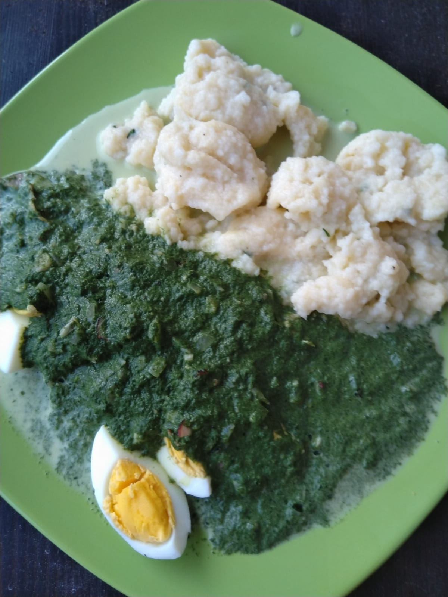
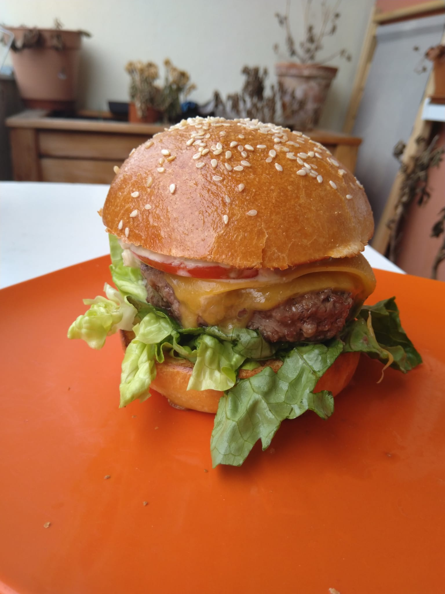

# Obsah

 * Polévky
	* [Špenátový krém s noky](#spenatovy-krem-s-noky)
 * Saláty
	* [Těstovinový salát](#testovinovy-salat)
 * Hlavní jídla
	* [Buřtguláš](#buřtguláš)
	* [Čínské nudle](#čínské-nudle)
	* [Filé po italsku](#filé-po-italsku)
	* [Gyros s pitou](#gyros-s-pitou)
	* [Hermelínový šáteček](#hermelínový-šáteček)
	* [Cheeseburger](#cheeseburger)
	* [Krevetové rizoto](#krevetove-rizoto)
	* [Kuře na paprice](#kuře-na-paprice)
	* [Kuskus s kuřecími nugetky](#kuskus-s-kuřecími-nugetky)
	* [Naked burger](#naked-burger)
	* [Pizza](#pizza)
	* [Rajská omáčka s karlovarským knedlíkem](#rajská-omáčka-s-karlovarským-knedlíkem)
	* [Sekaná s olivami](#sekaná-s-olivami)
	* [Slaný závin](#slany-zavin)
	* [Sýrová omáčka](#sýrová-omáčka)
	* [Špagety Carbonara](#špagety-carbonara)
	* [Tagliatelle s lososem](#tagliatelle-s-lososem)
	* [Utopenci](#utopenci)
 * Marinády
	* [Kečupová marináda](#kecupova-marinada)
	* [Pivní marináda](#pivni-marinada)
 * Dezerty
	* [Belgické vafle](#belgicke-vafle)
	* [Brownies](#brownies)
	* [Krtkův dort](#krtkuv-dort)
	* [Medovník](#medovník)
	* [Mramorové řezy](#mramorove-rezy)
 * Ostatní
	* [Briošky](#briosky)

# Polévky

## Špenátový krém s noky 

Polévka

* 1 balíček špenátového protlaku (neochuceného)
* 300 ml smetany
* 150 ml vody
* 1 malá cibule
* 1 stroužek česneku
* sůl, pepř, muškátový ořech

Noky

* 2 vejce
* 4 lžíce mléka
* 4 lžíce polohrubé mouky
* 6 lžic hrubé mouky
* sůl

Vypracovat těsto na noky a nechat odležet. Cibuli a česnek nakrájet na kostičky. Špenátový protlak nalít do hrnce, přilít vodu a dát vařit. Osmahnout cibulku do zlatova a poté k ní dát na chvilku osmahnout česnek.

Česnek s cibulkou přidat k vařícímu se protlaku. Osolit, opepřit. Stáhnout plamen a přilít smetanu, nechat probublávat na slabém plameni. Přistrouhat špetku muškátového ořechu.

Noky vykrajované čajovou lžičkou dát do polévky a nechat vše vařit na slabém plameni cca 20 minut.

> TIP: Dá se ozdobit parmazánem.

# Saláty

## Těstovinový salát 

* 300g penne těstovin
* 2 rajčata
* 1/4 červené papriky
* 4 ks zavařené papriky
* 10 dkg šunky
* 10 dkg nastrouhaného eidamu
* pár listů salátu
* bílý jogurt
* sůl, pepř, oregano, sezamová semínka, lněná semínka, bazalka
* olivový olej na pokapání

# Hlavní jídla

## Buřtguláš

* cca 1-2 litry vody (přidat/vyvařit dle potřeby)
* 5 větších brambor, 2 malé
* 6-8 špekáčků
* 1 cibule
* 30g sušené papriky (1 sáček)
* 2 stroužky česneku
* sůl, pepř, 4 kuličky nového koření, 4 bobkové listy, kmín, majoránka

Cibuli, špekáčky a větší brambory nakrájet na kostky (cibuli na malé kostičky). Špekáčky dát osmahnout na pánvičku. Do hrnce dát rozpálit tuk (olej, ale ještě lépe sádlo). Cibulku dát osmahnout dozlatova, jakmile začne zlatovatět, tak zasypat půlkou papriky. Promíchat a počkat až to trochu zpění. Pak zalít vodou a přidat brambory a veškeré koření. Stroužky česneku a dvě menší brambory nastrouhat najemno do vody. Jakmile se voda uvede k varu, přidat špekáčky a nechat alespoň hodinu vařit (průběžně míchat).

> TIP: Nejlépe guláš chutná poté, co se nechá přes noc odležet v chladu.

## Čínské nudle

* kousky masa (vepřové, kuřecí)
* klíčky
* 2 mrkve
* 2 cibule
* 1/2 paprika
* 1/4 čínského zelí
* rýžové nudle
* slaná sójová omáčka
* koření na čínu (bez soli)
* sůl dle chuti
* UME ocet dle chuti

Osmahnout kousky masa a oddělat z pánve. Nudle dát na 30 minut odmočit do teplé vody. Zeleninu (mrkev, cibule, paprika, zelí) nakrájet na nudličky a osmahnout na pánvi, ale tak aby zůstalo vše křupavé. Přidat maso, nudle a vodu (ne moc). Ochutit kořením, sójovkou a UME octem, solí dle chuti. Jakmile jsou nudle hotové, sundat z plotny a přimíchat klíčky.

## Filé po italsku

* filé z bílého rybího masa (například okoun)
* 10 cherry rajčat
* balení černých oliv
* čerstvá bazalka
* sůl, pepř
* olivový olej

Maso z jedné strany osolit a opepřit a druhou stranou (tou s kůží) dát na 2-3 minuty osmažit na pánev. Nakrájet rajčata na čtvrtiny a olivy na poloviny. Maso přendat do pekáčku, přisypat olivy, rajčata, bazalkové listy a přelít olivovým olejem. Dát péct do trouby na 15 minut na 200°C.

> TIP: Jako příloha se hodí kuskus

## Gyros s pitou

Pita (6 placek)

* 300 g hladké mouky
* 2 lžičky prášku do pečiva
* 200 ml mléka
* 1 lžička soli
* 2 lžičky cukru
* 2 lžíce oleje
* máslo na potírání

Marináda

* 300g vepřového masa na kostičky
* 1 sáček gyrosového koření (bez soli)
* 1 velká cibule
* sůl
* olej

Ostatní

* 1/2 okurky
* 4 lžíce bílého jogurtu
* 2 stroužky česneku (strouhaný)
* sůl, pepř
* 3 rajčata

Cibuli do marinády nakrájet na půlkolečka, promíchat koření, sůl, maso a cibuli, zalít olejem a nechat *dva* dny marinovat v chladném prostředí.

Na pity smíchat suché přísady, přilít mléko, olej a michát dokud nevznikne vláčné těsto, rozdělit na 6 dílků, a vyválet placky. Placky opékat na suché pánvi a po sundání potřít máslem.

Namarinované maso dát na rozpálenou pánev a za pravidelného míchání nechat zavřít. Z okurky, jogurtu, česneku, soli a pepře udělat tzatziki. Rajčata nakrájet na kolečka a kolečka položit na maso na pánvi. Trochu stáhnout plamen, nemíchat. Voda z rajčat pustí do masa a začne se vařit, vrstva rajčat bude zároveň sloužit jako poklice, pod kterou se maso podusí.

## Hermelínový šáteček

* Listové těsto (125g na porci)
* Hermelín (per porce)
* Grilovací koření
* Granátové jablko
* Mix listových salátů
* Zálivka (olivový olej, acetato balsamiko, citronová šťáva, cukr, sůl)
* Sezamová semínka
* 1 vejce

Hermelín naložit v grilovacím koření. Rozválet těsto, vložit hermelín doprostřed a zavázat těsto do podoby šátečku. Potřít šáteček rozmíchaným vejcem a posypat sezamem. Dát péct na 220°C na půl hodiny. Na talíři udělat kruh ze salátů se zálivkou a posypat semeny z granátového jablka a sezamem. Šáteček umístit do středu.

## Cheeseburger

* 125-200 g hovězího masa (per porce), cca 20 % tuku
* Plátky cheddaru
* Masité rajče
* Kyselé okurky
* Ledový salát
* Kečup, majonéza, oregano, bazalka (na dip)
* Tymián, sůl, pepř (koření do masa)

Pořádně promísit maso s kořením a vypracovat placičky. Nechat odležet v lednici. Poté maso ugrilovat/usmažit, dokud není na dotek tuhé. Housky rozkrojit a vnitřkem položit na rozpálenou pánev.

Burger adjustovat v pořadí - houska, dip, salát, maso, cheddar, okurky, rajče, dip, house.

> TIP: Pokud se maso smaží, je dobré vytvarovat placičky do tvaru sopky (vysoké okraje, nízký prostředek). Maso se pak nezdeformuje.

## Krevetové rizoto 

* 120-200 g krevet
* 1/2 žluté papriky
* 1 cibule
* 2 rajčata
* hrnek rýže
* bobkový list, nové koření

Rýži nechat odmočit, pak slít a dát do hrnce rychle osmahnout na oleji. Pak zalít 1 a 1/2 hrnku vody, přidat bobkový list a nové koření a sůl a nechat vařit, dokud se voda nevsákne do rýže. Cibuli, papriku i rajčata nakrájet na nudličky. Na rozpálenou pánev dát nejdřív papriku, aby změkla, pak přidat cibuli, poté krevety a ve chvíli, kdy jsou krevety hotové přidat rajčata. Vzniklou směs promíchat s rýží.

## Kuře na paprice

* 300 g kuřecích kousků
* půlka cibule
* sušená paprika v prášku
* 300 ml smetany
* nové koření, sůl, pepř

Kuřecí kousky opepřit, osolit a velice rychle osmahnout na oleji. Poté i s olejem nechat odležet. Na oleji v hrnci osmahnout cibuli, poté zasypat větším množstvím papriky a nechat zpěnit. Poté přisypat maso a pořádně promíchat, aby se suroviny o sebe pořádně otřely. Zalít vodou a nechat vařit. Přidat nové koření. Po patnácti minutách vaření sundat z plamene a přilít smetanu. Opět trochu povařit. Je možné zahustit jíškou. Podávat ideálně s rýží.

## Kuskus s kuřecími nugetky

* 500g kuřecích prs
* Půlka červené papriky
* Půlka červené cibule
* 8-10 cherry rajčat
* čerstvá petržel, oregáno, bazalka, pepř, sůl

Maso nakrájet na malé nugetky, okořenit oreganem, bazalkou, solí a pepřem a dát osmažit na pánev. Po dosmažení odložit bokem, olej nechat na pánvi. Papriku i cibuli nakrájet na malé kostičky. Papriku nasypat na pánev k oleji z masa a přidat 100ml vody. Dát vařit. Nakrájet rajčata na osminy a udělat kuskus. Až bude paprika měkká, přidat na minutu cibuli, pak rajčata a po další minutě odstavit z plamene. Přidat kuskus, maso a petržel a promíchat.

## Naked burger

* 200g masa na burger per porce
* 1 vejce per porce
* ledový salát
* cherry rajčata

Zálivka

* olivový olej
* acetato balsamiko
* pár kapek citronu
* sůl

Z masa vytvořit placičky a připravit je stejným způsobem jako na burger. Vejce buď připravit na sázený způsob, nebo jako volské oko. Cherry rajčata nakrájet na čtvrtiny, salát nalámat a smíchat se zálivkou. Na talíř naservírovat nejdříve salát, na něj umístit maso a na maso položit vejce. Jako příloha se hodí domácí hranolky nebo jen bageta.

## Pizza

Těsto

* 300g hladké mouky (italská bude chutnat líp)
* 4 lžíce olivového oleje
* lžička soli
* 1 žloutek
* 100ml vody

Omáčka na základ

* 500ml rajčatového protlaku
* 100g strouhaného sýra
* sůl, oregano, bazalka
* lze využít bílek, co zůstal od dělání těsta

Smíchat přísady na těsto a vypracovat do podoby koule. Kouli potřít po celém povrchu olejem, zabalit do igelitového sáčku a dát na 15 minut o lednice. Omáčku pořádně promíchat z přísad. Nachystat si přísady na ozdobení - vhodné jsou olivy, šunka, slanina, niva, mozzarela, eidam, cibule, paprika. Rajčata nejsou zcela vhodná - je v nich hodně vody a tudíž rozmočí těsto a navíc zůstanou dlouho horká. Jejich chuť je už obsažena protlaku.

Těsto rozdělit na třetiny - každá třetina se dá rozválet na kulatý plech o průměru 26cm. Rozválené těsto potřít omáčkou a pak zaskládat ozdobnými přísadami. Dát do trouby na 200°C na 15 minut.

> 7.5 sacharidových jednotek na pizzu.

## Rajská omáčka s karlovarským knedlíkem

* 250g masa na dvě porce

Omáčka

* Malá cibulka
* 200 ml vývaru
* 500 ml rajského protlaku
* lžička rumu
* sůl, pepř, perníkové koření, cukr dle chuti

Knedlíky (3-4 porce)

* 2 rohlíky
* 1 hrnek hrubé mouky
* 3/4 hrnku mléka
* 2 vejce
* sůl, petržel

Rohlíky nakrájet na kostičky. Vajíčka rozdělit na bílky a žloutky. Žloutky smíchat s moukou, solí a mlékem, vypracovat těsto. Z bílků a soli vyšlehat sníh. Opatrně smíchat kousky rohlíků, sníh, těsto a petržel. Hrnky vymazat a vysypat a naplnit směsí tak do tří čtvrtin. Hrnky položit do hrnce s vroucí vodou (ta nesmí sahat tak vysoko, aby se vlila do hrnků!), přiklopit poklicí a nechat být 15-20 minut.

Jako základ nakrájet cibuli na kostičky a dát na olej zesklovatět, pak zalít vývarem a protlakem, přidat rum a koření. Nechat chvíli povařit a přidat cukr dle chuti. Maso dochutit a vytvořit 10 kuliček. Naskládat do omáčky a nechat uvařit.

## Sekaná s olivami

* 500g mleté maso mix
* 1 balení oliv
* 1 červená paprika
* 1 vejce
* půlka cibule
* stroužek česneku
* čerstvá petržel, rozmarýn, tymián, pepř, sůl
* 2-3 lžíce strouhanky

Cibuli, česnek a petržel nakrájet na co nejmenší částice a spolu s ostatním kořením, vejcem a strouhankou pořádně propojit s mletým masem. Vyplatí se maso pasírovat mezi prsty, aby z něj byla pokud možno pasta, bude to celé lépe držet pohromadě. Papriku upéct (5-15 minut na 220°C), oloupat a nakrájet ji na krátké nudličky. Olivy nakrájet na půlky. Přidat cibuli a papriku k masu, pořádně promísit a vypracovat šišku. Dát na pekáč do trouby, lehce podlít vodou a péct hodinu na 200°C.

> TIP: Pro pečení v halogence se osvědčilo šišku zabalit do alobalu a v 15 minutových intervalech otáčet.

## Slaný závin 

Těsto (alternativně použít normální listové)

* 250 g hladké mouky
* 50 g másla
* 2 vejce
* 3 lžíce (cca 50 ml) vody
* 2 lžíce octa
* špetka soli

Náplň

* 1 menší cibule
* balení sterilovaného kyselého zelí
* 300g hovězího mletého masa
* 1/2 červené papriky
* trocha strouhaného eidamu

Na potření

* 1 rozmíchané vejce
* drcený kmín
* sůl

Papriku a cibuli nakrájet na kostičky a dát orestovat na pánev, přidat osolené mleté maso a promíchat, aby vznikla směs. Restovat tak dlouho, dokud maso nebude hotové.

Vypracovat ze surovin těsto, rozdělit na dvě půlky a z každé vyválet plát na nohavici. Plát posypat nastrouhaným sýrem, následně dát vrstvu zelí a poté vrstvu směsi z pánve. Zabalit do nohavice. Nakonec nohavice potřít rozmíchaným vejcem, posypat solí a kmínem a dát péct 20 minut z horní strany a případně dopéct 10 minut ze spodní strany na 200°C.

## Sýrová omáčka

* 300 ml smetany na vaření
* 100 g eidamu
* 100 g nivy
* Muškátový ořech, oregano, sůl, pepř

Uvedené suroviny se hodí na 2 porce. Smetanu nalít do hrnce s tlustými stěnami umístit nad **slabý** plamen. Smetana se musí ohřát tak, aby se z ní slabě kouřilo, ale nesmí bublat, jinak se to celé srazí. Jakmile začne být teplá, postupně začít přidávat nastrouhaný eidam a nivu nalámanou na malé kousky. Metlou pořádně míchat, aby se sýry ve smetaně pořádně rozpustily. Pak přidat koření (z muškátového ořechu nastrouhat pouze špetku) a chvilku nechat nad slabý plamenem, aby se chutě propojily.

> TIP: Jako příloha jsou výtečné třeba [noky](#špenátový-krém-s-noky) a k omáčce se skvěle hodí kuřecí kostičky usmažené na pánvi.

## Špagety Carbonara

* Půl paličky česneku
* 10 dkg slaniny
* 300g špaget
* 2 vejce
* smetana na šlehání
* parmazán
* sůl, pepř, muškátový oříšek

Dát vařit vodu na špagety a pořádně osolit. Jakmile voda vře, přidat špagety. Slaninu a česnek nakrájet na kostičky, slaninu dát smažit na pánev. Nastrouhat parmazán a v misce ho rozmíchat s vejcem a šlehačkou. Dochutit pepřem a přistrouhat k tomu trochu muškátového ořechu. Pár minut před tím, než budou špagety přídat ke slanině česnek s dostatkem oleje, aby se nepřipálil. Špagety po slití přidat na pánev ke slanině a česneku, pořádně promísit a poté celou pánev odebrat z plamene. Přilít směs smetany, vejce a ostatního do špaget a pořádně promíchat.

## Tagliatelle s lososem

* 300g lososa
* 500g tagiatelle
* 1 menší cibule
* 250ml smetany
* 40g másla
* hrst listového špenátu
* citronová šťáva, parmazán, sůl

Na másle orestovat nakrájenou cibuli, přidat na kostičky nakrájeného lososa bez kůže a restovat několik minut. Osolit, zalít smetanou a lžičkou citronové šťávy a provařit. Na závěr přidat nasekaný špenát a promíchat s uvařenými tagliatelle. Na ozdobení na talíži posypat nastrouhaným parmazánem.

## Utopenci

* Špekáčky s vysokým obsahem masa
* Cibule (cca 1 per 5 špekáčků)
* Nakládaná paprika (nebo chilli paprika - dle chuti)

Lák

* Lžička hořčičných semínek
* Lžíce cukru krystal
* 10 kuliček pepře
* 5 kuliček nového koření
* 4 bobkové listy
* Ocet

Dle nádoby a počtu špekáčků odměřit přibližně kolik bude potřeba octa. Špekáčky nechat aspoň hodinu odležet v teple a pak z nich stáhnout střívko. Koření i s octem dát do rendlíku a dát vařit (během vaření rozmíchat cukr). Špekáčky přeříznout napůl a cibuli nakrájet na tenká kolečka. Papriky nakrájet na tenké proužky. Pak vše naskládat do sklenice - na dno naskládat vrstvu cibule, pár proužků paprik, vrstvu špekáčků a pořádně upěchovat. Proces opakovat, dokud sklenice nebude plná. Uvařený lák nechat lehce schladnout a pak nalít do sklenice až po okraj. Sklenici zadeklovat a dát minimálně na týden dát do chladu.

# Marinády

https://bozka.cz/marinana-maso-7-skvelych-receptu-vyzkousejte-taky/

## Kečupová marináda 

 * Grilovací koření
 * 3 lžíce jemného kečupu
 * 8 lžíc rostlinného oleje
 * 1 lžíce sójové omáčky
 * 3 stroužky česneku (utřené s 1 lžící hořčice)

Promíchat přísady dohromady, naklepané, osolené a opepřené maso naložit do směsi a nechat uležet (ideálně dva dny).

# Pivní marináda 

* 150 ml piva
* 3 lžíce kečupu
* 1 lžička horčice
* 1 cibule (nakrájená na drobno)
* 1 chilli paprička
* 1/4 citronu
* 2 stroužky česneku (nakrájený na drobno)
* 1 lžička cukru
* tymián, rozmarýn, sůl, pepř

# Dezerty

## Belgické vafle 

* 180 g hladká mouky
* 3 ks vajec
* 7 lžic rostlivného oleje
* 150 ml mléka
* 2 lžíce cukru
* 2 lžičky kypřáku
* skořice
* špetka soli na sníh

Smíchat suché přísady. Z bílků ušlehat sníh. K suchým přísadám přidat žloutky, olej a mléko a vyšlehat těsto. Přidat sníh a promíchat stěrkou (nešlehat).

Rozehřát vaflovač a potřít plotny olejem. Péct cca 5-7 minut.

> Celkem má jídlo 16.5 sacharidových jednotek. Z těsta jde udělat cca 7-8 vaflí, což znamená cca 2 SJ na vafli.

## Brownies

* 125g cukr krystal
* 300g čokolády (ideálně 70% obsah čokolády)
* 4 vejce
* 100g mouka
* lžíce kypřícího prášku
* 125g másla

Na vodní lázni rozpustit máslo a v něm čokoládu. Vejce šlehat, dokud se na povrchu neobjeví lehká pěna a hmota nezesvětlá. Pak přidat cukr a pokračovat v mixování. Po několika minutách mixování opatrně přilít k rozpuštěné čokoládě, pořádně promíchat. Poté přidat mouku promísenou s kypřákem a promixovat do kompaktního těsta.

Pečící formu vyložit pečícím papírem, vlít těsto a dát péct aspoň na 30 minut na 180°C.

## Krtkův dort 

Korpus

* 100 ml oleje
* 100 g moučkového cukru
* 2 vejce
* 1 lžíce rumu
* 180 g polohrubé mouky
* 2 vrchovaté lžičky kakaa
* 1 prášek do pečiva
* 125 ml mléka

Náplň

* 5 banánů
* 500ml šlehačky na šlehání
* ztužovač
* 80 g čokolády na vaření (nastrouhané)

Olej, cukr a žloutky ušlehat, přidat rum a zamíchat. Přidat mouku smíchanou s kakaem a kypřákem, znovu prošlehat, nakonec lehce vmícht sníh z bílků. Vlít do vymazané dortové formy a péct na 180°C 30 minut.

Od kraje si nechat odstup 1,5 cm a vydlabat prostředek, ale dno těsta musí zůstat neporušené! Do vydlabaného prostoru vložit banány podélně přeříznuté vejpůl a zalít vyšlehanou šlehačkou, ve které je zamíchaná čokoláda. Na vzniklý kopeček nasypat/namačkat těsto, které předtím bylo vydlabáno.

## Medovník

TODO

## Mramorové řezy 

Těsto

* 2 hrnky polohrubé mouky
* 1 hrnek moučkového cukru
* 0.75 hrnku oleje
* 2 lžíce kakaa
* 2 vejce
* 1 hrnek mléka

Náplň

* 500 g tvarohu
* 2 sáčky práškového vanilkového pudingu
* 1 hrnek krystalového cukru
* 1 hrnek mléka
* 2 vejce

Přísady na těsto nejprve promíchat lžicí a pak promixovat. V jiné nádobě vypracovat náplň stejným způsobem. Do vymazané pečící nádoby nalít nerovnoměrně obě těsta a vidličkou zhlekha promíchat. Péct 20-30 minut na 200°C.

# Ostatní

## Briošky 

* 170 g hladké mouky
* 135 g hrubé mouky
* 60 g hery
* 1 vejce do těsta, jedno na potření
* 21 g droždí
* 1.5 dcl vody
* dvě vrchovaté čajové lžičky soli, drcený kmín

Droždí nastartovat (dát do mísy půlku vlažné vody, přisypat droždí, lžičku cukru a zlehka poprášit vodou a dát do tepla na půl hodiny). Jakmile je nastartováno, postupně přisypávat a rozmíchávat mouku, vodu, tuk a ostatní suroviny. Postupně vypracovat těsto. Opět dát na mísy a nechat hodinu kynout.

Z těsta vypracovat bochánky (z dávky jde udělat 7-8 menších nebo tak 4 větší na burger). V hrnku rozmíchat vidličkou jedno vejce a potřít jím bochánky z horní strany. Dát do trouby na 200°C, každých deset minut snížit teplotu o 20°C (neklesat pod 140°C).

> TIP: Po upečení nechat briošky chvíli chladnout, pak je zabalit do igelitového sáčku a nechat přes noc odležet. Druhý den budou pěkně měkké.

