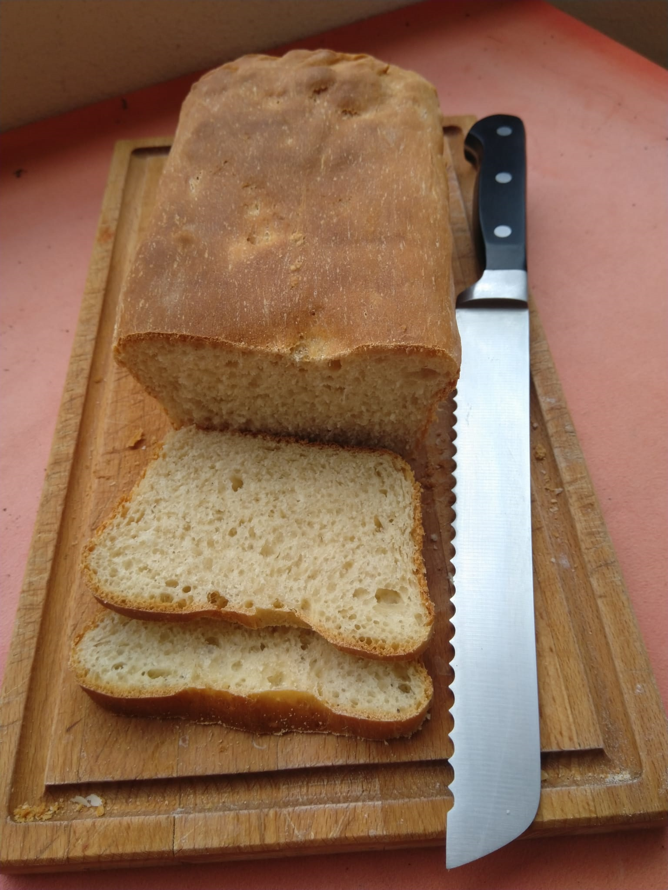

# Obsah

 * [Briošky](#briosky)
 * [Kváskové křupky](#kvaskove-krupky)
 * [Podmaslovy chleba](#podmaslovy-chleba)
 * [Toustový chleba](#toustovy-chleba)
 * [Zitny chleba](#zitny-chleba)

# Recepty

## Briošky 

* 170 g hladké mouky
* 135 g hrubé mouky
* 60 g másla
* 1 vejce do těsta, jedno na potření
* 1 sáček sušeného droždí
* 1.5 dcl mléka
* dvě vrchovaté čajové lžičky soli

Máslo vytáhnout z lednice, aby povolilo. Do zteplaného mléka nasypat sáček droždí, přidat pár lžic hladké mouky a promíchat. Nádobu neprodyšně zavřít a nechat 15-30 minut, než se droždí nastartuje. Pak přidat vejce a za průběžného mixování přidávat mouku. Jakmile je všechna mouka zapracovaná do těsta, přidat máslo a mixovat, dokud se nezapracuje i máslo.

Těsto překlopit do vymazané nádoby a zakryté nechat kynout dvě hodiny. Poté vyklopit těsto na pomoučený vál, rozdělit na čtyři stejně velké části a vypracovat z nich bochánky. Ty dát na plech na pečící papír a nechat dalších 45 minut kynout. Pak potřít směsí vejce a trochy mléky, posypat sezamovými semínky a dát do trouby na 180°C na 20 minut na ohřev z obou stran.

Po vyjmutí z trouby zakrýt utěrkou a nechat vychladnout.

## Kváskové křupky 

* 150 g žitného rozkvasu
	* 75 g žitné mouky
	* 75 g vody
	* pár lžic žitného kvásku
* 100 g hladké mouky
* 100 g žitné mouky
* 100 g špaldové mouky
* 2 lžíce sádla
* 1 vejce
* 1 lžička soli
* semínka/koření na ozdobení

Vypracovat ze surovin tuhé těsto a vyválet ho na 0.5 - 1 cm tlustý plát, a vykrajovátky ho nadělit na jednotlivé kusy křupek. Ty obalit ve směsi semínek/koření a dát na pečící papír na plech. Péct v předehřáté troubě na 180-200° C cca 15 minut.

## Podmáslový chleba

* 200g žitného rozkvasu
	* 100 g žitné mouky
	* 100 g vody
	* pár lžic žitného kvásku
* 375 pšeničné chlebové mouky
* 210 ml podmáslí
* 15 g soli
* 1 lžíce drceného kmínu

Ze surovin vypracovat tuhé těsto, ideálně i s pomocí robotu. Těsto dát do mísy a zakrýt utěrkou. Po hodině přeložit. Po další hodině opět přeložit, vypracovat bochník a dát do pomoučené ošatky na další dvě hodiny kynout.

Péct v předehřáté troubě na 230° na horní i dolní 15 minut, po tuto dobu mít v troubě misku s vodou. Poté vyndat misku, odvětrat troubu a dopéct na 190° na 30 minut na spodní ohřev.

## Toustový chleba 

* 350 g hladké mouky
* 1/2 sáčku sušeného droždí
* 250 ml mléka
* lžička soli
* 50 g másla

Smíchat mléko se 100 gramy mouky, přisypat droždí a nechat probudit. Přidat sůl, zbytek mouky a ostáte máslo a vypracovat těsto. Těsto nechat 2-3 hodiny kynout, periodicky překládat. Pak z těsta vypracovat špalek a položit do formy, nechat kynout, dokud nedosáhne uspokojivé velikosti. Péct v předehřáté troubě na 190°C, 10 minut zeshora i zespoda a 20 minut pouze zespoda.

## Žitný chleba 

* 400 g žitného rozkvasu
	* 200 g žitné mouky
	* 200 g vody
	* pár lžic žitného kvásku
* 150 g žitné mouky
* 150 g hladké pšeničné mouky
* 100 g špaldové mouky
* 3 lžičky soli
* semínka (slunečnice, mák, ...)
* 320 ml vlažné (převařené vody)

Smíchat přísady na rozvas a nechat v hermeticky izolované nádobě v pokojové teplotě ležet 12 hodin (ideálně přes noc).

Poté rozkvas smíchat se zbývajícími přísadami na těsto a nalít do máslem vymazané pečící formy. Pod utěrkou nechat v pokojové teplotě kynout další 2-3 hodiny.

Péct v předehřáté troubě na 230°C 10 minut ze všech stran, poté přepnout na spodní ohřev + horkovzduch a péct dalších 20 minut na 200°C.

